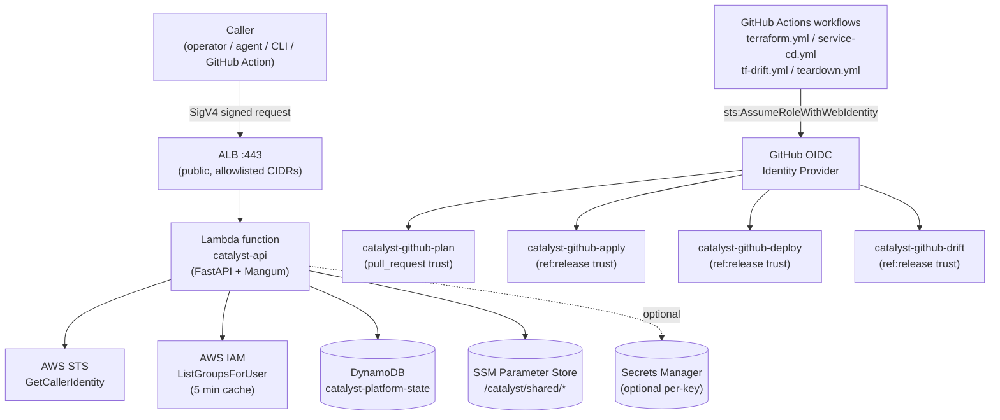
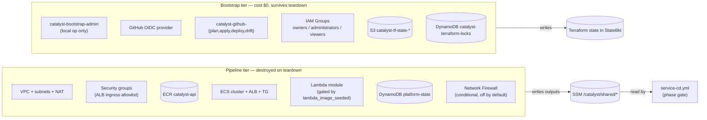
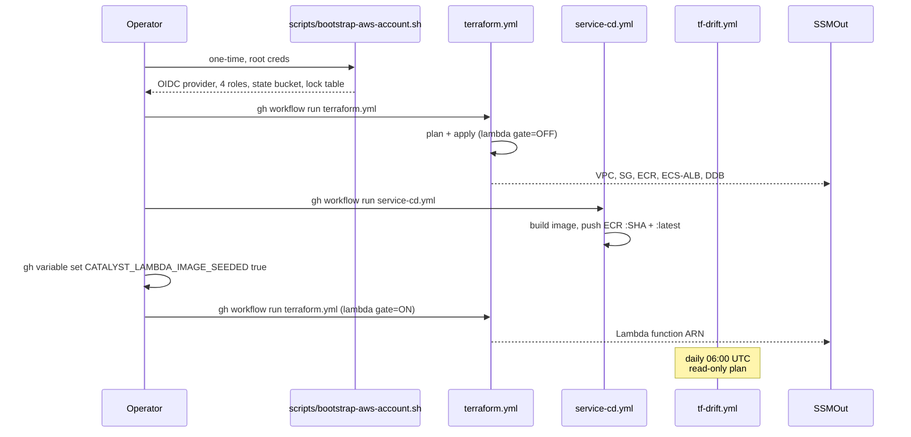

# Catalyst control-plane architecture

Source diagram for the Catalyst Internal Developer Platform control plane. Rendered inline by GitHub. Aligned with ADR-006 (CI/CD), ADR-007 (golden paths), ADR-008 (RBAC), ADR-009 (runtime), ADR-010 (egress).

## Request path

## Provisioning tiers

## Phase ordering enforcement (ADR-006)

See [ADR-006](../docs/ADR/ADR-006-cicd-pipeline-architecture.md) §"Phase ordering (hard constraint)" for the original mermaid this is derived from.
