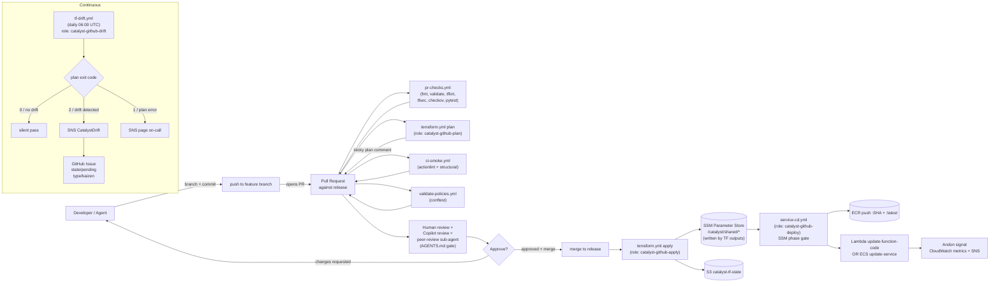
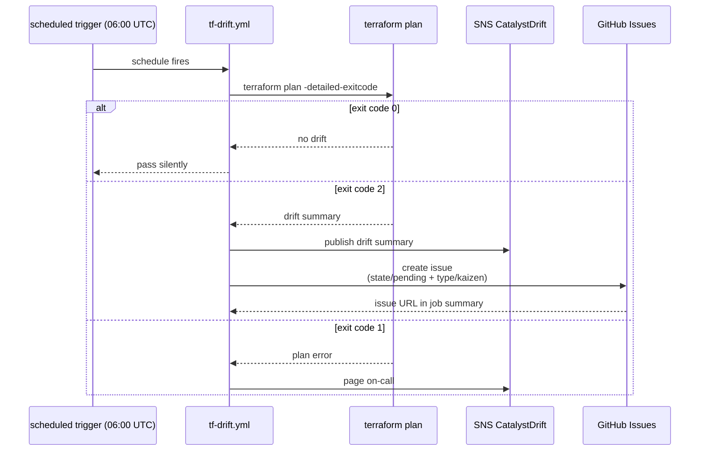

# Catalyst GitOps workflow

Every change to Catalyst — infrastructure, service code, configuration — flows through a Pull Request against `release`. The pipeline encodes the contract in ADR-006: plan visible before apply, OIDC trust scoped per role, drift detection daily.

## End-to-end flow

## Role separation (ADR-006 §IAM roles per pipeline)

| Pipeline phase | OIDC role | Trust subject | Permissions |
|---|---|---|---|
| Plan (PR validation) | `catalyst-github-plan` | `repo:Cloud-Byte-Consulting/Catalyst:pull_request` | Read-only on managed resources |
| Apply (release merge) | `catalyst-github-apply` | `repo:Cloud-Byte-Consulting/Catalyst:ref:refs/heads/release` | Full write on managed resources |
| Service deploy | `catalyst-github-deploy` | `repo:Cloud-Byte-Consulting/Catalyst:ref:refs/heads/release` | ECR push + Lambda/ECS update + SSM get |
| Drift detection | `catalyst-github-drift` | `repo:Cloud-Byte-Consulting/Catalyst:ref:refs/heads/release` | ReadOnlyAccess |

No long-lived AWS credentials anywhere. The bootstrap script (`scripts/bootstrap-aws-account.sh`) is the only step that requires human AWS credentials, and it runs once per account.

## Andon signal — drift becomes a tracked issue

This is the **andon cord** for the Catalyst platform — drift detected at 06:00 UTC enters the same state machine (ADR-001) that every other change goes through. An agent can pick it up by querying `gh issue list --label state/pending --label type/kaizen`.

See [ADR-001](../docs/ADR/ADR-001-github-issues-as-state-machine.md) for the durable state machine + audit trail design.
See [ADR-006](../docs/ADR/ADR-006-cicd-pipeline-architecture.md) for the consolidated workflow architecture.
