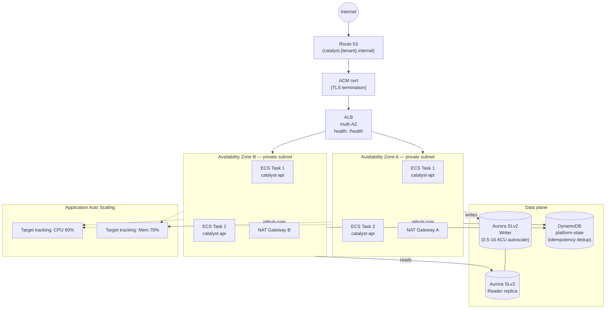

# Catalyst HA architecture (ECS scale-out variant)

The default runtime is Lambda container (per ADR-009). When Catalyst is deployed at enterprise scale, the same Docker image runs unchanged on ECS Fargate with the topology below. The pipeline switches runtimes via the `RUNTIME` GitHub Actions variable (`lambda` | `ecs`); no code or image changes.

## Multi-AZ ECS topology with Aurora Serverless v2

## Failure modes covered

| Failure | Mitigation |
|---|---|
| ECS task crash | ECS service restarts within ~30s; ALB health check removes target |
| AZ outage | Surviving AZ continues serving; new tasks reschedule via ECS service |
| NAT Gateway outage in one AZ | The other AZ's NAT routes egress; pipeline egress allowlist remains intact |
| Aurora writer failure | Aurora SLv2 promotes a reader within 30-60s; service retries on connection reset |
| Sustained load spike | Auto Scaling adds tasks (CPU and memory target-tracking); Aurora SLv2 scales ACUs |
| ALB target group instability | CloudWatch alarm pages on-call (5xx rate, p99 latency, healthy host count) |

## Out of demo scope (v2)

This diagram represents the **end-state** HA topology. The 24-hour demo runs Lambda only (cost-optimal for sporadic traffic). The ECS path, Aurora SLv2, and ACM cert are tracked in:
- ADR-009 — runtime strategy decision
- #62 — ECS task definition + execution role
- #82 — ACM + TLS module
- #85 / #86 — Aurora SLv2 module + wire-up
- #84 — ECS autoscaling

See [ADR-009](../docs/ADR/ADR-009-runtime-strategy.md) for the Lambda-vs-ECS trade-off analysis.
