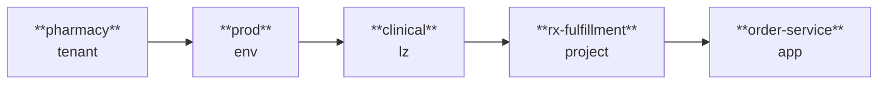

# ADR-002 — Tenant → Environment → LandingZone → Project → Application hierarchy

**Status**: Accepted · 2026-05-11

## Context

Up to ADR-008 Catalyst's data model assumed a flat shape: a deploy is "a
deploy of service X to environment Y." That works for one team, one
business unit, one AWS account. It does not work at enterprise scale,
where:

- The enterprise has multiple **lines of business** with different
  compliance scopes (Pharmacy and clinical-care carry HIPAA; Specialty
  carries HIPAA + 340B; some Health Services workloads carry HIPAA +
  PCI-DSS).
- Each LOB owns its own **lifecycle stages** (dev / qa / staging / prod /
  dr), often with non-uniform stage counts (some LOBs run 3, some 5).
- Each lifecycle stage maps to one or more **AWS landing zones** —
  account boundaries enforced by Control Tower / AFT — and the landing
  zone is the *compliance perimeter* (HIPAA controls attach here, not at
  the team level).
- Within a landing zone, multiple **software projects** live, each with
  its own team, repo, and DORA metrics.
- Each project ships one or more **applications** — the actual deployable
  units (services, jobs, scheduled functions, static UIs).

A flat data model collapses these distinctions and forces every policy,
audit, and observability concern to re-derive context from naming
conventions. That works at small scale and breaks loudly at large.

## Decision

Catalyst adopts a **five-level construct hierarchy** as its canonical
domain model:

```
Tenant
└── Environment
    └── LandingZone
        └── Project
            └── Application
```

Every Catalyst-managed object — a deploy, a secret-rotation, a preview-
env, a PR review, an ops-intel finding — is **anchored to exactly one
Application** (or higher: e.g., a tenant-wide deploy is anchored at the
Tenant level). The construct address `<tenant>/<env>/<lz>/<project>/<app>`
is the unique key for routing, RBAC, observability, and audit.

### Construct definitions (one-line each)

| Construct | What it is | Owner | Cardinality |
|---|---|---|---|
| **Tenant** | A line of business or major business unit (e.g., `pharmacy`, `clinical-care`, `specialty`, `health-services`, `payer-platform`) | LOB Engineering Lead | 5–20 per enterprise |
| **Environment** | A lifecycle stage scoped to a tenant (e.g., `pharmacy/dev`, `pharmacy/staging`, `pharmacy/prod`) | Tenant Platform Lead | 2–6 per tenant |
| **LandingZone** | An AWS account (or small AFT group) representing a compliance + isolation perimeter (e.g., `pharmacy/prod/clinical` for HIPAA-scoped clinical apps) | Cloud Security + Compliance | 1–3 per environment |
| **Project** | A coherent deliverable owned by one team — a repo, a backlog, a DORA scorecard | Team Lead / EM | 5–50 per landing zone |
| **Application** | A deployable workload — service / job / static UI / Lambda — with its own image/binary and runtime contract | Tech Lead / on-call rotation | 1–10 per project |

### Construct address — the canonical identifier



This address is:

- The path under which AWS resources are tagged (`Project=catalyst`,
  `Catalyst-Tenant=pharmacy`, `Catalyst-Env=prod`, `Catalyst-LandingZone=clinical`,
  `Catalyst-Project=rx-fulfillment`, `Catalyst-Application=order-service`).
- The label set applied to GitHub Issues (`tenant/pharmacy`, `env/prod`,
  `lz/clinical`, `project/rx-fulfillment`, `app/order-service`).
- The CloudWatch metric dimension set.
- The X-Ray trace annotation set.
- The IAM resource tag condition (`aws:ResourceTag/Catalyst-Tenant`).

Five anchored levels, one address.

### AWS Organizations — how OUs relate (partial alignment)

AWS Organizations exposes **organizational units (OUs)** and **accounts**.
Catalyst’s five-level **construct** model is the **logical** and **tagging**
source of truth for routing, RBAC, and audit. The two are **aligned where
AWS policy boundaries naturally match**; they are **not** a one-to-one copy
of every level, and **Project** / **Application** MUST NOT drive a separate
OU per workload by default (OU sprawl, slow onboarding, brittle SCPs).

| Construct | Typical Organizations mapping | Notes |
|---|---|---|
| **Tenant** | A **top- or mid-level OU subtree** (business unit / program) | Matches different SCP baselines per LOB (e.g. HIPAA vs non-HIPAA trees). Size the tree to what Control Tower + AFT can maintain. |
| **Environment** | **Account placement** and/or **child OUs** under a workloads tree (e.g. prod vs nonprod) | Strong alignment: prod accounts under stricter OUs / SCPs than dev and stage. See [ADR-003 — Static and ephemeral environments](ADR-003-static-and-ephemeral-environments.md) for static `dev` / `stage` / `prod` vs `preview-*`. |
| **LandingZone** | **Member account** (the compliance perimeter Control Tower / AFT vends) | One row in `landing_zones` ↔ one `aws_account_id` (or a documented small account group). OUs **contain** accounts; they are not a substitute for the LZ row. |
| **Project** | **Tags + IAM + construct address**, not an OU | Many projects share an account; one project can span accounts. Express isolation with roles, KMS, and tags. |
| **Application** | **Tags + IAM**, not an OU | Same as project; alarm and metric dimensions already carry `app/*`. |
| **Ephemeral / preview** | **Automation inside existing nonprod / sandbox accounts** (or a dedicated preview account), **not** a new OU per PR | Lifecycle is Issues (`type/preview-env`), TTL, and tags — not org-tree churn. |

**Summary:** Use OUs for **tenant- and policy-scale** segmentation and for
**grouping accounts** by environment class. Use **accounts** for **landing
zones**. Use the **full construct address** everywhere Catalyst reasons
about work; do not require the Organizations tree to mirror Project or
Application depth.

### Storage shape

The constructs are stored relationally in Aurora (rows + foreign keys);
their state machines (in-flight deploys, etc.) live in GitHub Issues
(per [ADR-001](ADR-001-github-issues-as-state-machine.md)). Aurora is the source of truth for the hierarchy itself
(slow-changing); GitHub Issues are the source of truth for in-flight
work (fast-changing).

| Concern | Source of truth | Why |
|---|---|---|
| Tenant catalog | Aurora `tenants` table | Slow-changing, joinable |
| Env catalog | Aurora `environments` table | Slow-changing |
| LZ catalog | Aurora `landing_zones` table | Slow-changing; carries `aws_account_id` |
| Project catalog | Aurora `projects` table | Slow-changing |
| Application catalog | Aurora `applications` table | Slow-changing; carries deploy-strategy + Score-spec ref |
| In-flight deploy | GitHub Issue with `tenant/X`, `env/Y`, `lz/Z`, `project/A`, `app/B` labels | Fast-changing state machine ([ADR-001](ADR-001-github-issues-as-state-machine.md)) |
| Audit trail per construct | Aurora `audit_events` table + GitHub Issue comments | Aurora for cross-cutting queries; GH for the work-item trail |

## Benefits

### Compliance scoping
- HIPAA / PCI / 340B controls attach at **LandingZone** level — exactly
  where AWS Control Tower / AFT places them. Catalyst does not need to
  re-derive compliance scope from naming conventions or tags inferred
  from project names; it walks up the tree and reads
  `LandingZone.compliance_frameworks: ["HIPAA"]`.
- A misconfigured application **cannot** affect a different LandingZone
  by construction — the AWS account boundary is the blast-radius wall.
  This is the same pattern Gaia uses for vertical isolation.

### Blast-radius clarity
- Tenant isolation: a Pharmacy automation cannot touch clinical-care
  resources because the IAM `apply` role's tag-condition pins
  `Catalyst-Tenant`. Cross-tenant moves require an explicit cross-tenant
  flow (which itself is a `type/onboarding` Issue with explicit
  approval).
- Environment isolation: the same `Pharmacy` tenant has separate dev /
  prod landing zones — a `prod` deploy is unreachable from a `dev`
  worker.
- Project isolation: project-scoped IAM, KMS aliases, and SNS topics
  prevent unrelated teams from reading each other's secrets or audit
  logs.

### Cost attribution
- AWS Cost Explorer queries roll up cleanly along the hierarchy via the
  five-tag dimension. "What did Pharmacy/prod cost in April?" becomes
  one query, not a heuristic over resource names.
- Bedrock daily-token budget is per-app *or* per-project *or* per-tenant
  depending on which level enforces the cap. This composability is free
  with the hierarchy.

### Observability and DORA at the right grain
- DORA metrics (deploy frequency, lead time, change-fail rate, MTTR)
  attach naturally at **Project** level — that's the team-level grain.
  Aggregation up the tree (per-tenant DORA) is a simple roll-up.
- Alarm namespacing: `catalyst.<tenant>.<env>.<project>.<app>.5xx`. SREs
  reading the alarm name immediately know who owns it without a lookup.

### Multi-tenancy without per-tenant code paths
- All Catalyst services treat the construct address as an opaque tuple.
  No `if tenant == "pharmacy"` branches anywhere. Onboarding a new tenant
  is a Terraform run, not a code release.

### Honda alignment
- **Standardised work**: every Catalyst automation has the same
  five-field shape (tenant, env, lz, project, app). Auditors, on-call,
  and AI agents all read the same address.
- **Genchi Genbutsu**: the address is real — every level corresponds to
  a real organisational concept and a real AWS resource (or set), not an
  abstract bucket. SREs can `cd` into the project's directory and find
  the actual code.
- **Andon**: the GitHub Project board can filter by any level
  (`tenant/pharmacy AND env/prod AND state/blocked-on-human` is one
  query), so the andon stays useful as the population grows.

### Maps to enterprise reality
The mandate from the recruiter ("automate things developers and back-end
infrastructure teams regularly request like blue/green deployments,
creating secrets in secure manager... reduce the workload of a cloud
operations team through automation") implicitly assumes work is bucketed
by team / project / environment. The hierarchy makes that bucketing
first-class instead of leaving it implicit in naming conventions.

## Cons / costs we accept

### 1. Cognitive load
Five levels is a lot. New engineers spend ~30 minutes understanding why
"pharmacy/prod/clinical/rx-fulfillment/order-service" is *the* address.
Documentation and a `cli/catalyst onboard` wizard mitigate this; the
construct hierarchy doc is the second link in the README's
"new-engineer 30-min path" specifically because of this cost.

**Mitigation**: a `catalyst constructs tree` CLI command that prints the
visible hierarchy for a given tenant (you don't have to memorise it —
read it).

### 2. Naming explosion
The full address is 5 path components. URLs, IAM names, and
CloudWatch alarm names get long (`catalyst-pharmacy-prod-clinical-rx-fulfillment-order-service-task-role` is 76 characters). AWS has 64-character limits in some places.

**Mitigation**:
- Adopt **stable short slugs** at each level (3-letter tenant code:
  `phr` instead of `pharmacy`, etc.) for AWS resource naming. The
  long human-readable forms stay in tags.
- Pre-flight Terraform validation rejects names that would exceed AWS
  per-service limits.
- The `iam-role` module's `role_name` validator already enforces the
  pattern.

### 3. RBAC complexity
A five-level hierarchy means GitHub teams + AWS IAM roles need to
permission at *some* level — but which one? Tenant-level admins,
environment-level approvers, project-level engineers, application-level
deployers — each is a real role.

**Mitigation**:
- Default RBAC scheme: tenant-admin, environment-approver,
  project-maintainer, application-deployer. Documented in
  `docs/SECURITY.md`.
- The `tenant-onboarding` Terraform module creates the full role set on
  every tenant onboard so the matrix is reproducible, not bespoke.

### 4. Premature abstraction risk
For a tenant with only 1 environment, 1 landing zone, 1 project, 1 app
— five levels is overkill on day one. The flat shape works fine.

**Mitigation**:
- The hierarchy is **not** required to be deep. A tenant CAN have one
  env, one LZ, one project, one app. The cost is just five rows in
  Aurora, not five separate AWS accounts. The structure is there for
  growth without re-architecting.
- The CONSTRUCTS.md doc explicitly says "use the smallest hierarchy that
  fits your tenant; expand only when you have a reason."

### 5. Migration cost (if applied to an existing flat IDP)
Re-tagging existing AWS resources, re-mapping existing repos to the
hierarchy, re-permissioning IAM — non-trivial.

**Mitigation**:
- For Catalyst (greenfield), this is sunk cost. We're not migrating an
  existing flat IDP; the hierarchy is the design from day one.
- If we ever needed to migrate an existing system in: provide a
  one-shot `catalyst migrate-flat-to-hierarchy` script using the
  construct CLI. Out of scope for the code-challenge submission.

### 6. Cross-cutting queries
Some queries naturally cross the hierarchy: "all in-flight deploys
across the entire enterprise." With five levels, this is a tree-walk
not a single index lookup.

**Mitigation**:
- Aurora has a denormalised `construct_address` materialised column
  (`pharmacy/prod/clinical/rx-fulfillment/order-service` as one
  string) on every audit row, so cross-cutting queries are
  index-friendly. The materialised column is maintained by a trigger,
  not application code.
- For GitHub Issues: a single label query
  (`is:issue label:state/agent-working`) gives the top-level cross-cut;
  per-tenant filters add `label:tenant/X`.

### 7. Construct address embedded in many places
The address shape (the order, the level count) becomes a
weight-bearing API contract. Adding a 6th level later, or removing the
landing-zone level, would break every CloudWatch alarm name, IAM role
name, and tag set.

**Mitigation**:
- ADR-002 itself is the lock-in. Changing the hierarchy requires a new
  ADR superseding this one, with an explicit migration plan.
- The construct schema in `docs/CONSTRUCT-SCHEMA.md` is versioned —
  schema v2 would be a deliberate breaking change with its own ADR.

## Alternatives considered

| Alternative | Why rejected |
|---|---|
| **Flat (no hierarchy)** | Works for one tenant. Breaks at enterprise scale. Forces re-deriving compliance scope from names. |
| **3 levels (Tenant → Project → Application)** | Conflates Environment and LandingZone. Loses the compliance boundary. The team's day-to-day mandate (blue/green per env) becomes harder to model. |
| **4 levels (Tenant → Env → Project → App; LZ implicit in env)** | Strong contender. Rejected because it ties LZ to env 1:1, which doesn't match reality (some envs span 2 LZs for HIPAA + non-HIPAA workload separation; some LZs span 2 envs for cost-saving on lower envs). |
| **6 levels (add Region or Cell between LZ and Project)** | Over-fits. Region is an AWS resource attribute, not an organisational construct. Cell-based architecture (multi-cell within an LZ) is a future concern that doesn't justify a level today. |
| **Abstract "Resource" with parent pointers (graph)** | Maximum flexibility; opaque to humans. Rejected — the explicit hierarchy is more legible. |

## Implementation pointers

- **Schema** (formal spec): `docs/CONSTRUCT-SCHEMA.md`
- **Conceptual model** (humans): `docs/CONSTRUCTS.md`
- **Pydantic models**: `services/catalyst-api/catalyst/models/constructs.py`
- **Aurora DDL**: `services/catalyst-api/migrations/001_constructs.sql`
- **GitHub label additions**: extension of the `github-bootstrap` module
  (additive — new `tenant/*`, `env/*`, `lz/*`, `project/*`, `app/*`
  prefix labels)
- **AWS Organizations / Control Tower**: OU and account vending MUST follow
  the **partial alignment** table in `### AWS Organizations — how OUs relate`
  (OUs for tenant and environment-class policy boundaries; accounts for
  landing zones; projects/apps via tags — not one OU per project).
- **Tenant onboarding**: `infrastructure/modules/composite/tenant-onboarding/`
- **CLI**: `catalyst constructs {ls,tree,show,create}` (planned —
  scaffolded but not yet implemented; tracked as Phase-3 follow-up)

## Update cadence

The hierarchy itself is high-stakes-low-frequency. ADR-002 is reviewed
when:
- A new tenant onboarded reveals a level mismatch.
- A compliance framework requires a perimeter Catalyst can't currently
  represent.
- AWS releases a new account-isolation primitive that changes the
  LandingZone shape.

Otherwise, the schema is stable. Quarterly review of metrics like
"average tree depth per tenant" tells us whether the hierarchy is
useful in practice.

Last reviewed: 2026-05-08.
