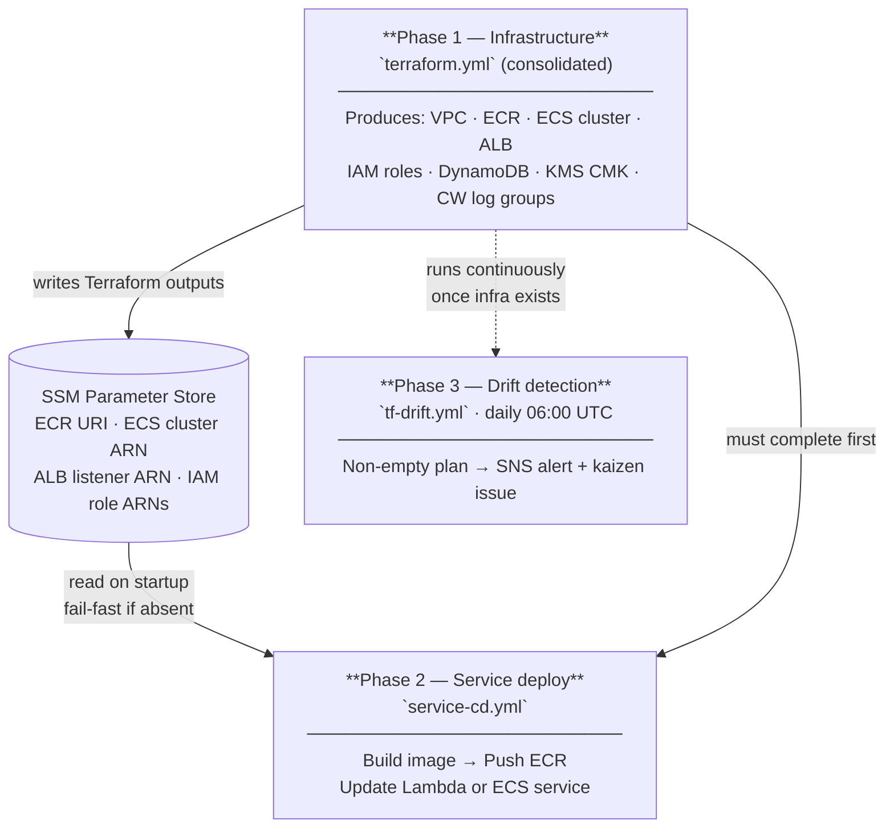

# ADR-006 — CI/CD pipeline architecture for Catalyst

**Status**: Accepted · 2026-05-14
**Related**: [ADR-001](ADR-001-github-issues-as-state-machine.md) · [ADR-002](ADR-002-construct-hierarchy.md) · [ADR-007](ADR-007-catalyst-api-golden-paths.md) · [ADR-009](ADR-009-runtime-strategy.md) · [ADR-010](ADR-010-egress-control.md) · [ADR-015](ADR-015-terraform-state-partitioning.md) · [docs/rlm-integration-guide.md](../rlm-integration-guide.md)

> **State-key generation**: the `terraform.yml`, `service-cd.yml`, and `tf-drift.yml` workflows below assume the single-key backend (`catalyst/platform.tfstate`). [ADR-015](ADR-015-terraform-state-partitioning.md) commits the platform to a four-tier state-key hierarchy; pipelines that target L2/L3/L4 generate their backend keys at apply time via `-backend-config="key=…"`. The migration is captured as a deferred follow-up in ADR-015 §Deferred.

---

## Context

Catalyst needs automated pipelines that can provision infrastructure, deploy the platform API, and detect configuration drift — all without long-lived AWS credentials in GitHub Secrets. The pipeline architecture must encode a hard ordering constraint: the Catalyst API cannot be deployed until the AWS resources it runs on exist. Violating that ordering on a fresh account produces a non-recoverable partial state.

Three capabilities are needed:

1. **Infrastructure provisioning** — apply Terraform modules that produce the VPC, ECR repo, ECS cluster, ALB, IAM roles, DynamoDB table, KMS CMK, and CloudWatch log groups the API depends on.
2. **Service deployment** — build the API container image, push it to ECR, register a new ECS task definition revision, and roll the ECS service to that revision.
3. **Drift detection** — periodically run `terraform plan` without applying and alert when the real AWS state diverges from the committed Terraform state.

GitHub Actions with OIDC token exchange is the chosen substrate (established by ADR-001 §9 and the AWS OIDC rule in `AGENTS.md`). No `AWS_ACCESS_KEY_ID` / `AWS_SECRET_ACCESS_KEY` secrets are stored in GitHub.

---

## Decision

### Three GitHub Actions workflows (consolidated as of PR #115)

| Workflow file | Trigger | Purpose |
|---|---|---|
| `terraform.yml` | PR opened / synchronized against `release`, AND push to `release` | Single HashiCorp-style consolidated pipeline. On PRs assumes the plan role and runs `init` + `fmt -check` + `plan` (sticky comment). On `push -> release` assumes the apply role and runs `apply -auto-approve`. `role-to-assume` selects between `AWS_ROLE_PLAN_ARN` and `AWS_ROLE_APPLY_ARN` based on `github.event_name` + `github.ref`. |
| `service-cd.yml` | Push to `release` after `terraform.yml` apply succeeds, or manual dispatch | Build image → push ECR (`:${SHA}` always; `:latest` only when absent) → update Lambda (`update-function-code`) or ECS service (`update-service`) based on `RUNTIME` env var |
| `tf-drift.yml` | Schedule: daily at 06:00 UTC | Run `terraform plan` in read-only mode (`-lock=false`, drift role); publish drift summary to SNS + open `state/pending` issue on exit code 2 |

> Earlier revisions of this ADR described `tf-plan.yml` + `tf-apply.yml` as a
> two-workflow split with a GitHub Environment approval on apply. PR #115
> collapsed them into the single `terraform.yml` above to match the
> `hashicorp/setup-terraform` starter template and to remove the
> environment-bound JWT subject (the bootstrap-managed apply role trusts the
> `ref:refs/heads/release` sub directly, not `environment:production`). The
> approval gate can be re-introduced later by extending the role trust to
> accept an environment-scoped sub; this ADR will be amended at that time.

### Runtime selection — Lambda vs ECS

`service-cd.yml` branches on the `RUNTIME` GitHub Actions variable (`lambda` or `ecs`, default `lambda`). Both paths share the ECR build and push step; the deploy step diverges:

```yaml
- name: Deploy (Lambda)
  if: env.RUNTIME == 'lambda'
  run: |
    aws lambda update-function-code \
      --function-name catalyst-api \
      --image-uri $ECR_URI

- name: Deploy (ECS)
  if: env.RUNTIME == 'ecs'
  run: |
    TASK_DEF=$(aws ecs register-task-definition ...)
    aws ecs update-service --cluster catalyst --service catalyst-api \
      --task-definition $TASK_DEF
```

See [ADR-009](ADR-009-runtime-strategy.md) for the full Lambda vs ECS trade-off analysis and Terraform module structure.

### Phase ordering (hard constraint)



Phase 2 **must not run on a fresh account** before Phase 1 has completed. `service-cd.yml` enforces this by reading the ECR URI and ECS cluster name from SSM Parameter Store (written by Terraform outputs). If those SSM paths are absent the workflow fails fast with a clear message rather than a partial-deploy error.

#### Bootstrap dance (seed-first, deploy-second)

The strict "fail fast on missing SSM" stance above has one carved-out exception: the **runtime** SSM parameter (`/catalyst/shared/lambda/catalyst-api/arn` or `/catalyst/shared/ecs/cluster/arn`). On a fresh account the Lambda function (or ECS cluster) cannot exist until Terraform creates it; but Terraform's `lambda-service` module bootstraps `image_uri = ${ECR}:latest`, which in turn cannot resolve until `service-cd.yml` has seeded that tag into ECR. That is a chicken-and-egg that aborts on first cold start (see [#68](https://github.com/Cloud-Byte-Consulting/Catalyst/issues/68)).

[PR #125](https://github.com/Cloud-Byte-Consulting/Catalyst/pull/125) resolves the cycle by splitting `service-cd.yml` into two jobs and softening the runtime gate:

1. **`build-and-push`** — **always** runs. Builds the image and pushes both `:${SHA}` and (on first cold start only) `:latest` to ECR. This job has no runtime-readiness precondition, so it can seed ECR before the Lambda function exists.
2. **`deploy`** — runs after `build-and-push` succeeds. Its readiness check (`Check Lambda runtime readiness` / `Check ECS runtime readiness`) **logs and exits 0** if the runtime SSM parameter is missing, rather than failing the job. The image is now in ECR, so the operator can flip `CATALYST_LAMBDA_IMAGE_SEEDED=true` and re-run `terraform.yml` to provision the runtime; then re-running `service-cd.yml` exercises the steady-state update path.

The cold-start no-op preserves a non-failing pipeline so the seed lands, but it does emit a `::warning::` annotation and a `$GITHUB_STEP_SUMMARY` note (added by [#128](https://github.com/Cloud-Byte-Consulting/Catalyst/issues/128)) so the run is visually distinct from a real successful deploy. A genuine `ssm:GetParameter` permission failure still surfaces as a job error — the no-op path triggers only on `ParameterNotFound`.

### Path-filtered component tests

Earlier revisions of `pr-checks.yml` ran every CI job on every PR. A doc-only change triggered `python-tests` + `cli-tests` + `terraform-quality` + everything else — wasted runner time, slower feedback, masked which component a failure actually came from. [#208](https://github.com/Cloud-Byte-Consulting/Catalyst/issues/208) restructured the workflow around a single `dorny/paths-filter@v3` fan-in job and a `test-summary` aggregator.

**Component → CI-job map.** Lives in `skills/test-coverage-discipline/SKILL.md` (the `/test-coverage-discipline` skill). That skill is the single source of truth for which test files and which CI jobs own each top-level path glob; this ADR intentionally does not duplicate the table so the two surfaces cannot drift.

**Aggregator pattern.** A top-level `changes` job emits a boolean output per component glob (`python`, `cli`, `infra`, `workflows`, `cursor`, `bootstrap`, `policies`, `e2e`). Each downstream test job carries `needs: changes` plus a three-way OR `if:`:

```yaml
if: |
  needs.changes.outputs.<component> == 'true' ||
  vars.FORCE_ALL_TESTS == 'true' ||
  contains(github.event.pull_request.labels.*.name, 'force-all-tests')
```

A fan-in `test-summary` job at the bottom `needs:` every conditional job, runs `if: always()`, and parses `toJson(needs)` to fail only when any upstream reports `failure` or `cancelled`. `skipped` upstream jobs are treated as pass — that is the whole point of the path filter. **`test-summary` is the only required status check on `release`** (see `infrastructure/modules/github/variables.tf` default: `["test-summary"]`). A doc-only PR can merge because every component test skipped and `test-summary` is green; a `services/catalyst-api/`-only PR runs `python-tests` + `e2e-tests`, skips the rest, and `test-summary` reports the aggregate.

**Three full-suite escape hatches** for wide-blast-radius changes:

1. **`workflow_dispatch` on `full-suite.yml`** — manual button-press; mirrors `pr-checks.yml`'s job set with `if: always()` and writes a per-job result table to `$GITHUB_STEP_SUMMARY`.
2. **Repository variable `FORCE_ALL_TESTS=true`** — flips the second OR clause; every PR runs the full suite until the flag flips back.
3. **PR label `force-all-tests`** — flips the third OR clause for a single PR.

Use the narrowest scope that gives confidence. See `skills/test-coverage-discipline/SKILL.md` Rule 3 for the full-suite-vs-path-filter decision tree.

### IAM roles per pipeline

| Role | Scope | Trust condition |
|---|---|---|
| `catalyst-github-plan` | `terraform plan` only — read permissions on all managed resources | `repo:Cloud-Byte-Consulting/Catalyst:pull_request` |
| `catalyst-github-apply` | Full write on managed resources | `repo:Cloud-Byte-Consulting/Catalyst:ref:refs/heads/release` |
| `catalyst-github-deploy` | ECR push + Lambda `update-function-code` (Lambda path) + ECS `register-task-definition` + `update-service` (ECS path) + SSM `GetParameter` | `repo:Cloud-Byte-Consulting/Catalyst:ref:refs/heads/release` |
| `catalyst-github-drift` | `terraform plan` on schedule/dispatch — read-only (`ReadOnlyAccess` managed policy) | `repo:Cloud-Byte-Consulting/Catalyst:ref:refs/heads/release` |

All four roles share the same OIDC identity provider (`token.actions.githubusercontent.com`), provisioned by `scripts/bootstrap-aws-account.sh` (imperative bash; the `modules/iam/` Terraform module mirrors the same shape for test/documentation parity but is not the deployment vector). The drift role was added in CICD-11a (#130) because `schedule` and `workflow_dispatch` events emit `sub: ref:refs/heads/release`, which the plan role's `pull_request`-only sub rejects with `sts:AssumeRoleWithWebIdentity Not authorized`. Security hardening of the drift role (env-scoped sub, `job_workflow_ref` condition, explicit allow/deny IAM policy, GitHub Environment, env-scoped secret) is tracked in CICD-11b (#124).

### Manual approval gate (deferred)

The previous design called for `tf-apply.yml` to target a GitHub `production` Environment with required reviewer approval. PR #115 deferred this gate: binding the consolidated `terraform.yml` to an environment would mutate the OIDC JWT `sub` claim and break the bootstrap-managed `catalyst-github-apply` trust policy (which trusts the bare `ref:refs/heads/release` subject). Re-enabling the gate requires first extending the apply role's trust policy to accept the env-scoped sub. Until then, the safety perimeter is enforced via branch protection on `release` plus the strict OIDC trust subject.

### Drift detection

`tf-drift.yml` runs `terraform plan -detailed-exitcode`:
- Exit code 0 → no drift, workflow passes silently.
- Exit code 2 → drift detected; workflow publishes a summary to the `CatalystDrift` SNS topic and opens a GitHub Issue with label `state/pending` + `type/kaizen` so the drift is tracked through the standard state machine.
- Exit code 1 → plan error; workflow fails and pages via SNS.

---

## Resources that must exist before `service-cd.yml` can run

These are all delivered by Phase 1 Terraform modules (sub-issues of #7). Lambda-only and ECS-only resources are noted; shared resources are required by both runtimes.

| Resource | Module | SSM path | Runtime |
|---|---|---|---|
| ECR repository URI | `modules/ecr/` (TF-3) | `/catalyst/shared/ecr/catalyst-api/uri` | Both |
| ALB listener ARN | `modules/alb/` (TF-4) | `/catalyst/shared/alb/listener/arn` | Both |
| Lambda function ARN | `modules/lambda-service/` | `/catalyst/shared/lambda/catalyst-api/arn` | Lambda |
| Lambda execution role ARN | `modules/iam/` (TF-7) | `/catalyst/shared/iam/lambda-execution-role/arn` | Lambda |
| ECS cluster ARN | `modules/ecs-cluster/` (TF-4) | `/catalyst/shared/ecs/cluster/arn` | ECS |
| ECS task execution role ARN | `modules/iam/` (TF-7) | `/catalyst/shared/iam/ecs-execution-role/arn` | ECS |
| ECS task role ARN | `modules/iam/` (TF-7) | `/catalyst/shared/iam/catalyst-api-task-role/arn` | ECS |
| DynamoDB table name | `modules/dynamodb/` (TF-5) | `/catalyst/shared/dynamodb/platform-state/table-name` | Both |
| KMS CMK ARN | `modules/kms/` (OPT1-1) | `/catalyst/shared/kms/cmk/arn` | Both |

`service-cd.yml` reads the `RUNTIME` variable first, then validates only the SSM paths relevant to the selected runtime before proceeding.

---

## Consequences

**Positive**
- No long-lived credentials anywhere in the pipeline.
- Plan output is always visible to reviewers before any apply.
- Drift is caught daily and automatically enters the issue state machine.
- Phase ordering is mechanically enforced via SSM path checks — no documentation-only constraint.

**Negative / trade-offs**
- Two separate workflows mean a PR author cannot see the full end-to-end result until after merge; they only see the plan.
- The SSM-based phase gate adds ~5 seconds to `service-cd.yml` startup.
- Manual approval gate on `tf-apply.yml` is a coordination cost — someone must approve every infrastructure change, including small ones.

**Deferred**
- Multi-environment promotion (dev → staging → prod) — current design targets a single `shared` environment. Environment matrix is a follow-up once ADR-003 environments are fully provisioned.
- Rollback automation — if `service-cd.yml` detects ECS stabilisation failure, it currently leaves the service in a failed state. Auto-rollback to the previous task definition revision is tracked under the `auto-rollback-armed` label pattern but not implemented in v1.

---

## References

- [ADR-001 §9 — Labels and Project managed by Terraform](ADR-001-github-issues-as-state-machine.md)
- [ADR-007 — Catalyst API golden paths](ADR-007-catalyst-api-golden-paths.md)
- CICD-0 umbrella: [#33](https://github.com/Cloud-Byte-Consulting/Catalyst/issues/33)
- Infrastructure umbrella: [#7](https://github.com/Cloud-Byte-Consulting/Catalyst/issues/7)
- `AGENTS.md` AWS OIDC rule
