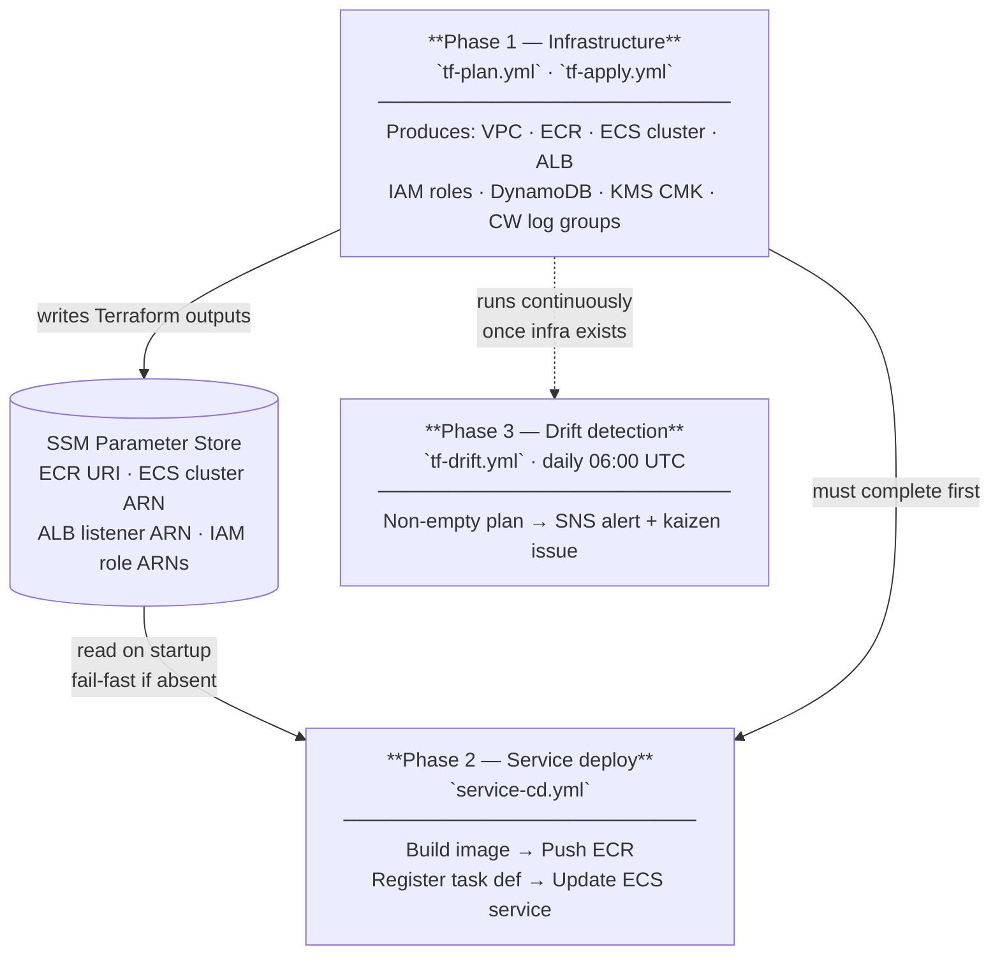

# ADR-006 — CI/CD pipeline architecture for Catalyst

**Status**: Accepted · 2026-05-14
**Related**: [ADR-001](ADR-001-github-issues-as-state-machine.md) · [ADR-002](ADR-002-construct-hierarchy.md) · [ADR-007](ADR-007-catalyst-api-golden-paths.md) · [ADR-009](ADR-009-runtime-strategy.md) · [ADR-010](ADR-010-egress-control.md) · [docs/rlm-integration-guide.md](../rlm-integration-guide.md)

---

## Context

Catalyst needs automated pipelines that can provision infrastructure, deploy the platform API, and detect configuration drift — all without long-lived AWS credentials in GitHub Secrets. The pipeline architecture must encode a hard ordering constraint: the Catalyst API cannot be deployed until the AWS resources it runs on exist. Violating that ordering on a fresh account produces a non-recoverable partial state.

Three capabilities are needed:

1. **Infrastructure provisioning** — apply Terraform modules that produce the VPC, ECR repo, ECS cluster, ALB, IAM roles, DynamoDB table, KMS CMK, and CloudWatch log groups the API depends on.
2. **Service deployment** — build the API container image, push it to ECR, register a new ECS task definition revision, and roll the ECS service to that revision.
3. **Drift detection** — periodically run `terraform plan` without applying and alert when the real AWS state diverges from the committed Terraform state.

GitHub Actions with OIDC token exchange is the chosen substrate (established by ADR-001 §9 and the AWS OIDC rule in `AGENTS.md`). No `AWS_ACCESS_KEY_ID` / `AWS_SECRET_ACCESS_KEY` secrets are stored in GitHub.

---

## Decision

### Four GitHub Actions workflows

| Workflow file | Trigger | Purpose |
|---|---|---|
| `tf-plan.yml` | PR opened / synchronized against `release` | Run `terraform plan`, post sticky comment with plan output |
| `tf-apply.yml` | Push to `release` (merge) | Run `terraform apply` with manual approval gate via GitHub Environment |
| `service-cd.yml` | Push to `release` after `tf-apply.yml` succeeds, or manual dispatch | Build image → push ECR → deploy to Lambda or ECS (runtime-selectable via `RUNTIME` env var) |
| `tf-drift.yml` | Schedule: daily at 06:00 UTC | Run `terraform plan` in read-only mode; publish drift summary to SNS if non-empty plan |

### Runtime selection — Lambda vs ECS

`service-cd.yml` branches on the `RUNTIME` GitHub Actions variable (`lambda` or `ecs`, default `lambda`). Both paths share the ECR build and push step; the deploy step diverges:

```yaml
- name: Deploy (Lambda)
  if: env.RUNTIME == 'lambda'
  run: |
    aws lambda update-function-code \
      --function-name catalyst-api \
      --image-uri $ECR_URI

- name: Deploy (ECS)
  if: env.RUNTIME == 'ecs'
  run: |
    TASK_DEF=$(aws ecs register-task-definition ...)
    aws ecs update-service --cluster catalyst --service catalyst-api \
      --task-definition $TASK_DEF
```

See [ADR-009](ADR-009-runtime-strategy.md) for the full Lambda vs ECS trade-off analysis and Terraform module structure.

### Phase ordering (hard constraint)



Phase 2 **must not run on a fresh account** before Phase 1 has completed. `service-cd.yml` enforces this by reading the ECR URI and ECS cluster name from SSM Parameter Store (written by Terraform outputs). If those SSM paths are absent the workflow fails fast with a clear message rather than a partial-deploy error.

### IAM roles per pipeline

| Role | Scope | Trust condition |
|---|---|---|
| `catalyst-github-plan` | `terraform plan` only — read permissions on all managed resources | `repo:Cloud-Byte-Consulting/Catalyst:pull_request` |
| `catalyst-github-apply` | Full write on managed resources | `repo:Cloud-Byte-Consulting/Catalyst:ref:refs/heads/release` |
| `catalyst-github-deploy` | ECR push + Lambda `update-function-code` (Lambda path) + ECS `register-task-definition` + `update-service` (ECS path) + SSM `GetParameter` | `repo:Cloud-Byte-Consulting/Catalyst:ref:refs/heads/release` |

All three roles share the same OIDC identity provider (`token.actions.githubusercontent.com`), provisioned by `CICD-1` using the `modules/iam/` module from #7.

### Manual approval gate

`tf-apply.yml` targets the GitHub Environment named `production`. The environment requires at least one reviewer approval before the apply step runs. The plan output from `tf-plan.yml` is linked in the approval request so reviewers see exactly what will change before approving.

### Drift detection

`tf-drift.yml` runs `terraform plan -detailed-exitcode`:
- Exit code 0 → no drift, workflow passes silently.
- Exit code 2 → drift detected; workflow publishes a summary to the `CatalystDrift` SNS topic and opens a GitHub Issue with label `state/pending` + `type/kaizen` so the drift is tracked through the standard state machine.
- Exit code 1 → plan error; workflow fails and pages via SNS.

---

## Resources that must exist before `service-cd.yml` can run

These are all delivered by Phase 1 Terraform modules (sub-issues of #7). Lambda-only and ECS-only resources are noted; shared resources are required by both runtimes.

| Resource | Module | SSM path | Runtime |
|---|---|---|---|
| ECR repository URI | `modules/ecr/` (TF-3) | `/catalyst/shared/ecr/catalyst-api/uri` | Both |
| ALB listener ARN | `modules/alb/` (TF-4) | `/catalyst/shared/alb/listener/arn` | Both |
| Lambda function ARN | `modules/lambda-service/` | `/catalyst/shared/lambda/catalyst-api/arn` | Lambda |
| Lambda execution role ARN | `modules/iam/` (TF-7) | `/catalyst/shared/iam/lambda-execution-role/arn` | Lambda |
| ECS cluster ARN | `modules/ecs-cluster/` (TF-4) | `/catalyst/shared/ecs/cluster/arn` | ECS |
| ECS task execution role ARN | `modules/iam/` (TF-7) | `/catalyst/shared/iam/ecs-execution-role/arn` | ECS |
| ECS task role ARN | `modules/iam/` (TF-7) | `/catalyst/shared/iam/catalyst-api-task-role/arn` | ECS |
| DynamoDB table name | `modules/dynamodb/` (TF-5) | `/catalyst/shared/dynamodb/platform-state/table-name` | Both |
| KMS CMK ARN | `modules/kms/` (OPT1-1) | `/catalyst/shared/kms/cmk/arn` | Both |

`service-cd.yml` reads the `RUNTIME` variable first, then validates only the SSM paths relevant to the selected runtime before proceeding.

---

## Consequences

**Positive**
- No long-lived credentials anywhere in the pipeline.
- Plan output is always visible to reviewers before any apply.
- Drift is caught daily and automatically enters the issue state machine.
- Phase ordering is mechanically enforced via SSM path checks — no documentation-only constraint.

**Negative / trade-offs**
- Two separate workflows mean a PR author cannot see the full end-to-end result until after merge; they only see the plan.
- The SSM-based phase gate adds ~5 seconds to `service-cd.yml` startup.
- Manual approval gate on `tf-apply.yml` is a coordination cost — someone must approve every infrastructure change, including small ones.

**Deferred**
- Multi-environment promotion (dev → staging → prod) — current design targets a single `shared` environment. Environment matrix is a follow-up once ADR-003 environments are fully provisioned.
- Rollback automation — if `service-cd.yml` detects ECS stabilisation failure, it currently leaves the service in a failed state. Auto-rollback to the previous task definition revision is tracked under the `auto-rollback-armed` label pattern but not implemented in v1.

---

## References

- [ADR-001 §9 — Labels and Project managed by Terraform](ADR-001-github-issues-as-state-machine.md)
- [ADR-007 — Catalyst API golden paths](ADR-007-catalyst-api-golden-paths.md)
- CICD-0 umbrella: [#33](https://github.com/Cloud-Byte-Consulting/Catalyst/issues/33)
- Infrastructure umbrella: [#7](https://github.com/Cloud-Byte-Consulting/Catalyst/issues/7)
- `AGENTS.md` AWS OIDC rule
