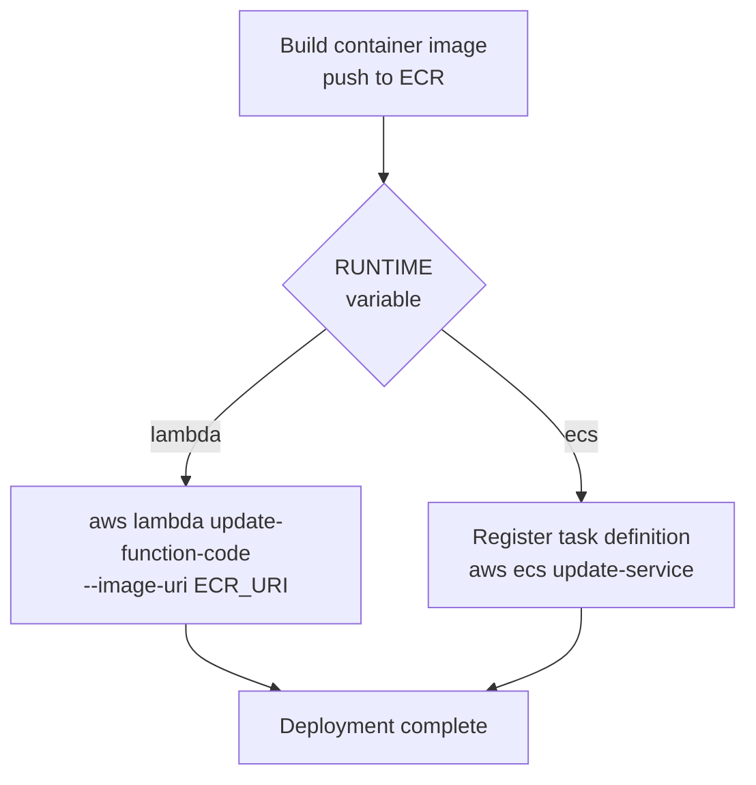

# ADR-009 — Catalyst API runtime strategy: Lambda container (default) + ECS Fargate (scale-out option)

**Status**: Accepted · 2026-05-14
**Related**: [ADR-006](ADR-006-cicd-pipeline-architecture.md) · [ADR-007](ADR-007-catalyst-api-golden-paths.md) · [ADR-010](ADR-010-egress-control.md)

---

## Context

The Catalyst API is a FastAPI service that:
- Handles low-to-moderate traffic (IDP golden paths are called on demand, not at constant high RPS)
- Returns a correlation ID immediately and offloads provisioning work to background workflows (GitHub Issues → agent)
- Has no request processing that approaches 15 minutes (the Lambda max timeout)
- Needs to run on AWS with no long-lived credentials

The initial architecture assumed ECS Fargate. The question is whether Lambda with container image support is sufficient and simpler, while keeping ECS as an available scale-out option.

---

## Decision

**Lambda container is the default runtime.** ECS Fargate is the alternative for scale-out or sustained-load scenarios. Both runtimes are supported by dedicated Terraform modules; the CI/CD pipeline selects the runtime via a variable.

### Why Lambda container is the default

The Catalyst API's request pattern maps well to Lambda:

- **Request pattern**: Burst on-demand (engineers onboarding apps, triggering deploys). Not sustained high-RPS.
- **Request duration**: All golden-path handlers are fast — validate input, create GitHub Issue, return correlation ID. No handler blocks on Terraform execution.
- **Cost at rest**: Lambda scales to zero. An idle Catalyst deployment costs nothing beyond the ALB minimum. An ECS Fargate task runs continuously.
- **Operational simplicity**: No cluster to manage, no service stabilisation to monitor, no task definition revisions to track.
- **Container image parity**: Lambda supports container images up to 10 GB. The same FastAPI Docker image runs identically on Lambda and ECS — no code changes needed to switch runtimes.

### Why ECS Fargate is kept

- **Sustained load**: If Catalyst is deployed at enterprise scale with constant high-frequency calls, Lambda per-invocation overhead adds up.
- **Cold start sensitivity**: Provisioned concurrency mitigates cold starts, but adds cost. For teams where cold starts are unacceptable, ECS is the correct choice.
- **In-memory state**: The ADR-008 IAM group cache is per-Lambda-execution-environment. On ECS, a single task's cache is consistent across all requests it serves. At high RPS this difference is meaningful (fewer `ListGroupsForUser` calls).
- **Option**: Any team can toggle to ECS by changing one pipeline variable.

---

## Terraform module structure

```
infrastructure/modules/
  lambda-service/          ← Lambda function (container image), IAM execution role,
  │                           ALB target group (target_type = "lambda"), CloudWatch log group
  ecs-service/             ← ECS Fargate cluster, task definition, service,
  │                           ALB target group, CloudWatch log group
  alb/                     ← Shared ALB + listener (used by both runtimes)
  ecr/                     ← ECR repository (shared — image pushed once, deployed to either)
```

Both `lambda-service` and `ecs-service` modules expose the same output interface:

| Output | Description |
|---|---|
| `service_endpoint` | ALB DNS name |
| `task_role_arn` | IAM role the service code runs as |
| `log_group_name` | CloudWatch log group |

The `alb` and `ecr` modules are runtime-agnostic and always deployed in Phase 1. Only one of `lambda-service` / `ecs-service` is instantiated per environment.

---

## ALB integration

Lambda can be fronted by an ALB via an `aws_lambda_permission` resource and a target group with `target_type = "lambda"`. This means the ALB layer is **identical** for both runtimes — the same listener rules, the same health check path (`/health`), the same TLS termination.

```hcl
# modules/lambda-service/main.tf (excerpt)
resource "aws_alb_target_group" "catalyst_api" {
  name        = "catalyst-api"
  target_type = "lambda"
}

resource "aws_lambda_permission" "alb" {
  action        = "lambda:InvokeFunction"
  function_name = aws_lambda_function.catalyst_api.function_name
  principal     = "elasticloadbalancing.amazonaws.com"
  source_arn    = aws_alb_target_group.catalyst_api.arn
}
```

---

## Pipeline runtime selection

`service-cd.yml` reads the `RUNTIME` Actions variable (repository-level default: `lambda`):



Switching runtimes requires:
1. Change the `RUNTIME` Actions variable in the repo settings (or workflow dispatch input).
2. Ensure the target module was provisioned by `tf-apply.yml` (the SSM path check in `service-cd.yml` validates this automatically).

No code changes. No Docker image changes.

---

## IAM roles per runtime

| Role | Runtime | Purpose |
|---|---|---|
| `catalyst-lambda-execution-role` | Lambda | Basic Lambda execution + ECR pull + CloudWatch Logs write + DynamoDB + SSM + STS |
| `catalyst-ecs-execution-role` | ECS | ECS task execution (ECR pull, CloudWatch Logs) |
| `catalyst-api-task-role` | ECS | Application-level permissions (DynamoDB, SSM, STS, IAM) |

Lambda collapses the ECS execution + task role split into a single execution role — acceptable because Lambda's execution environment is already single-tenant per invocation.

---

## Application adapter

Lambda requires an ASGI-to-Lambda translation layer. The Catalyst API uses **Mangum** for this:

```python
# services/catalyst-api/catalyst/main.py
from fastapi import FastAPI
from mangum import Mangum

app = FastAPI()
# ... routes ...

handler = Mangum(app)  # Lambda entrypoint; ignored when running under uvicorn (ECS)
```

The Lambda function's handler is set to `catalyst.main.handler`. When running on ECS, uvicorn serves `catalyst.main:app` directly — the `handler` symbol is defined but never called. No conditional logic, no runtime flags in application code.

`mangum` is included in `requirements.txt` unconditionally. It is a thin wrapper (~300 lines) with no operational cost when unused.

---

## Consequences

**Positive**
- Default runtime is simpler and costs less at rest.
- No code changes needed to switch between runtimes — single pipeline variable (`RUNTIME`).
- The same Docker image is used regardless of runtime.
- Both runtimes use the same ALB, so the external endpoint is stable.
- Mangum is the only runtime-specific dependency; it adds no overhead on ECS.

**Negative / trade-offs**
- Lambda cold starts on first invocation after idle. Mitigated with 1–2 provisioned concurrency instances if needed.
- Lambda in-memory cache (ADR-008 IAM group cache) resets on cold start. Acceptable — first call after cold start makes one extra `ListGroupsForUser` call.
- Two Terraform modules to maintain for the service layer. Kept intentionally minimal; they share the ALB and ECR modules.

**Deferred**
- Provisioned concurrency configuration — not set in v1. Add if cold-start latency becomes a complaint.
- Lambda function URL (no ALB) — simpler than ALB but loses WAF and fixed DNS. Deferred; ALB is consistent across runtimes.

---

## References

- [ADR-006 — CI/CD pipeline architecture](ADR-006-cicd-pipeline-architecture.md)
- [ADR-007 — Catalyst API golden paths](ADR-007-catalyst-api-golden-paths.md)
- [ADR-008 — Catalyst API RBAC](ADR-008-catalyst-api-rbac.md)
- Infrastructure umbrella: [#7](https://github.com/Cloud-Byte-Consulting/Catalyst/issues/7)
- Service umbrella: [#18](https://github.com/Cloud-Byte-Consulting/Catalyst/issues/18)
