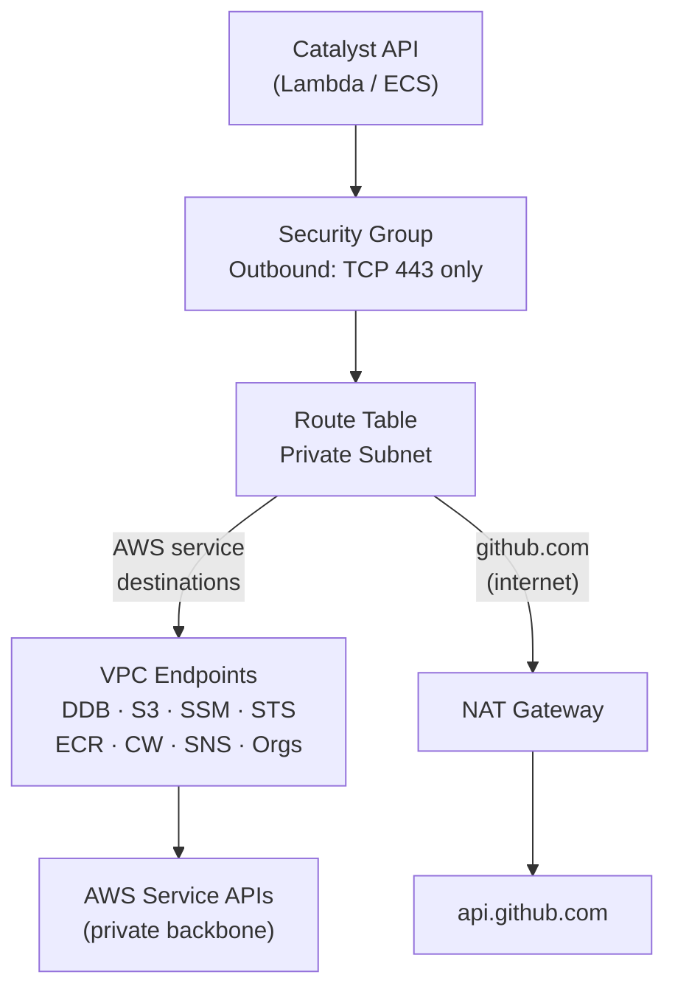
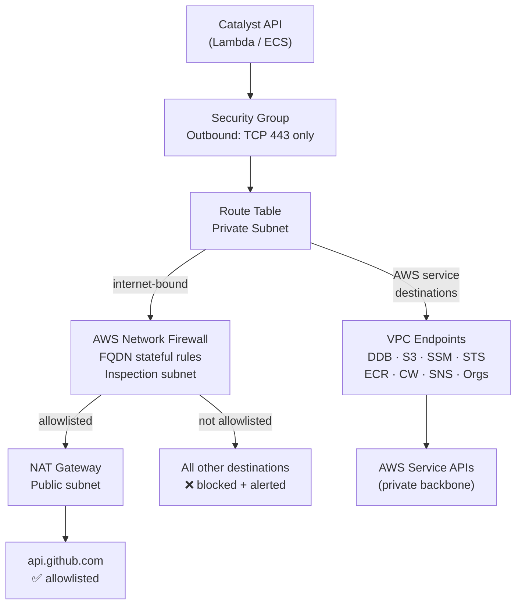

# ADR-010 — Egress control for Catalyst workloads

**Status**: Accepted · 2026-05-14
**Related**: [ADR-002](ADR-002-construct-hierarchy.md) · [ADR-006](ADR-006-cicd-pipeline-architecture.md) · [ADR-009](ADR-009-runtime-strategy.md)

---

## Context

The Catalyst API runs in private subnets (Lambda or ECS — ADR-009) and has two distinct egress surfaces:

1. **AWS service calls** — DynamoDB, SSM, STS, ECR, CloudWatch Logs, SNS, AWS Organizations, Bedrock (OPT2). These never need to leave the AWS backbone.
2. **Internet-bound calls** — GitHub API (`api.github.com`) for the Issues state machine (ADR-001). This is the only legitimate internet destination for the API process.

Without explicit egress controls, both traffic classes would route through a NAT Gateway to the internet. This is:
- Unnecessarily expensive for AWS service calls (NAT data charges + higher latency).
- Non-compliant for landing zones carrying `HIPAA` or `PCI-DSS` in ADR-002's `lz.compliance_frameworks` field — those frameworks require traffic to traverse a managed inspection boundary.

The AWS Well-Architected Security Pillar (SEC 5) and CIS AWS Foundations Benchmark both require VPC Endpoints for AWS service traffic and restrict outbound Security Group rules to explicit ports and destinations. The AWS Landing Zone Accelerator — the closest public reference implementation to Catalyst's model — uses centralized Network Firewall for internet egress in all compliance-scoped environments.

---

## Decision

Egress control is **two-tier**, driven by the landing zone's `compliance_frameworks` field:

| Tier | When applied | Components |
|---|---|---|
| **Baseline** | All landing zones | VPC Interface + Gateway Endpoints · NAT Gateway · restrictive outbound Security Groups · VPC Flow Logs |
| **Compliance** | `lz.compliance_frameworks` contains `HIPAA` or `PCI-DSS` | Baseline + AWS Network Firewall (FQDN allowlist) |

The `modules/vpc/` Terraform module always provisions the baseline tier. The `modules/network-firewall/` module is conditionally applied by the `tenant-onboarding` composite module based on the LZ compliance posture.

---

## Baseline tier — all landing zones

### VPC Endpoints

All AWS service traffic from Catalyst workloads is routed over PrivateLink — it never traverses a NAT Gateway or the internet.

**Gateway Endpoints** (free, route-table based):

| Service | Endpoint type |
|---|---|
| DynamoDB | Gateway |
| S3 | Gateway (required for ECR image layer pulls — ECR stores layers in S3) |

**Interface Endpoints** (hourly cost per AZ):

| Service | Endpoint name | Used by |
|---|---|---|
| SSM Parameter Store | `com.amazonaws.{region}.ssm` | API startup phase gate, config reads |
| STS | `com.amazonaws.{region}.sts` | RBAC — `GetCallerIdentity` on every request |
| ECR API | `com.amazonaws.{region}.ecr.api` | Image metadata |
| ECR Docker | `com.amazonaws.{region}.ecr.dkr` | Image pull on cold start |
| CloudWatch Logs | `com.amazonaws.{region}.logs` | Application log ingestion |
| SNS | `com.amazonaws.{region}.sns` | Drift alerts, alarm notifications |
| AWS Organizations | `com.amazonaws.{region}.organizations` | Tier 1 OU/LZ/Environment ops |
| Bedrock Runtime | `com.amazonaws.{region}.bedrock-runtime` | OPT2 — AI PR reviewer (conditional) |

Each interface endpoint has its own Security Group that allows HTTPS :443 inbound only from the Catalyst API Security Group. No other resource in the VPC can call these endpoints.

### NAT Gateway

One NAT Gateway per AZ in the public subnet. Used **only** for internet-bound traffic (GitHub API). All AWS service traffic is intercepted by the VPC Endpoints above and never reaches the NAT Gateway.

### Security Groups

The Catalyst API Security Group (Lambda or ECS task) has a single outbound rule:

| Direction | Protocol | Port | Destination |
|---|---|---|---|
| Outbound | TCP | 443 | `0.0.0.0/0` |

All other outbound traffic is denied. Port 443 covers both VPC Endpoint traffic (intercepted at the subnet route table) and NAT-bound GitHub API calls.

### VPC Flow Logs

Enabled on the VPC, published to CloudWatch Logs (`/aws/vpc/flowlogs/{lz-slug}`), retained 90 days. Required by CIS AWS Foundations Benchmark and used for incident investigation.

### Baseline traffic flow



---

## Compliance tier — HIPAA / PCI-DSS landing zones

AWS Network Firewall is inserted between the private subnet route table and the NAT Gateway. All internet-bound traffic passes through the firewall before egress.

### FQDN stateful rule group

The rule group uses `STRICT_ORDER` (`stateful_rule_options.rule_order = STRICT_ORDER`). Rules are evaluated in ascending priority order; the first match wins. Without `STRICT_ORDER`, AWS Network Firewall uses `DEFAULT_ACTION_ORDER` where action type (pass > drop > alert) overrides rule position — which would cause the deny rules to shadow the allow rule for `api.github.com`. `STRICT_ORDER` makes the intent unambiguous.

| Priority | Rule | Protocol | Action | Rationale |
|---|---|---|---|---|
| 100 | `api.github.com` | TCP :443 | Pass | Issues state machine — only allowed subdomain |
| 200 | `*.github.com` | TCP :443 | Drop + Alert | Block all other GitHub subdomains (prevent git push exfiltration) |
| 300 | `*.amazonaws.com` | TCP :443 | Drop + Alert | All AWS traffic must use VPC Endpoints — not internet |
| 65535 | `0.0.0.0/0` | TCP :443 | Drop + Alert | Deny-all default — block and log every unlisted destination |

Priority 100 (allow `api.github.com`) is evaluated before priority 200 (deny `*.github.com`), so `api.github.com` traffic is explicitly passed before the wildcard deny can match it.

The deny-all default means **new internet destinations require an explicit ADR or runbook change** — accidental outbound calls to unexpected hosts are blocked and alerted, not silently permitted.

### Compliance traffic flow



### SNS alert on firewall deny

The Network Firewall alert rule publishes to the `CatalystEgressDeny` SNS topic. A CloudWatch metric filter on the firewall logs drives an alarm that pages on-call when an unlisted destination is attempted. Each alert is a hansei trigger — either the allowlist needs updating (legitimate new destination) or a workload is misbehaving.

---

## Terraform module structure

```
infrastructure/modules/
  vpc/                         ← Always applied. VPC, subnets, route tables,
  │                               Gateway Endpoints (DDB, S3), Interface Endpoints
  │                               (SSM, STS, ECR, CW, SNS, Orgs, Bedrock),
  │                               NAT Gateway, Flow Logs, Security Groups.
  network-firewall/            ← Conditionally applied. Firewall, inspection subnet,
                                  stateful FQDN rule group, SNS alert topic.
```

The `tenant-onboarding` composite module reads `var.compliance_frameworks` and conditionally calls `network-firewall/`:

```hcl
module "network_firewall" {
  count  = length(setintersection(var.compliance_frameworks, ["HIPAA", "PCI-DSS"])) > 0 ? 1 : 0
  source = "../../modules/network-firewall"
  vpc_id = module.vpc.vpc_id
  ...
}
```

---

## Cost model

| Component | Baseline | Compliance (adds) |
|---|---|---|
| Interface Endpoints (8 × 2 AZs) | ~$117/month | same |
| Gateway Endpoints (DDB, S3) | Free | Free |
| NAT Gateway (2 AZs) | ~$65/month + data | same |
| VPC Flow Logs storage | ~$5–15/month | same |
| Network Firewall (2 AZs) | — | ~$395/month + $0.065/GB |
| **Total estimate** | **~$190/month** | **~$585/month** |

The interface endpoint cost (~$117/month) is offset by eliminating NAT data charges for AWS API calls, which can exceed that at moderate traffic.

---

## Consequences

**Positive**
- AWS service calls never traverse the internet — reduced attack surface, lower latency, predictable cost.
- Compliance landing zones have verifiable egress control — FQDN allowlist is auditable and change-controlled.
- Single outbound Security Group rule (TCP 443) is easy to reason about and audit.
- VPC Flow Logs provide the audit trail required by CIS Benchmark and HIPAA audit controls.
- New internet destinations require explicit policy change — no silent outbound expansion.

**Negative / trade-offs**
- Interface endpoint hourly cost is fixed regardless of traffic. At very low traffic, NAT-only would be cheaper (but non-compliant).
- Network Firewall adds ~$395/month to compliance LZ cost. This is a compliance cost, not an engineering choice.
- Adding a new allowlisted destination in compliance environments requires a Terraform PR — intentional friction.

**Deferred**
- **Centralized egress VPC** (Transit Gateway hub-and-spoke) — the Landing Zone Accelerator pattern routes all internet egress through a single inspection VPC shared across accounts. Deferred until multi-account LZ expansion (ADR-002 §4 follow-up).
- **IPv6 Egress-Only Internet Gateway** — not in scope for v1.
- **VPC Endpoint policies** (restrict DynamoDB endpoint to the Catalyst table only, restrict SSM endpoint to Catalyst parameter paths) — additive hardening, tracked as a `type/kaizen` candidate.

---

## References

- [ADR-002 — Construct hierarchy and `compliance_frameworks`](ADR-002-construct-hierarchy.md)
- [ADR-009 — Runtime strategy (Lambda / ECS)](ADR-009-runtime-strategy.md)
- AWS Well-Architected Security Pillar — SEC 5: Protect network resources
- CIS AWS Foundations Benchmark v2 — 5.x Networking controls
- AWS Landing Zone Accelerator — egress VPC pattern
- Infrastructure umbrella: [#7](https://github.com/Cloud-Byte-Consulting/Catalyst/issues/7)
