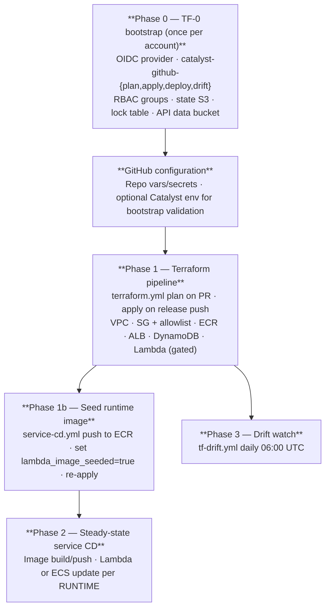

# ADR-012 — Onboarding into Catalyst: three audience-sliced tracks

**Status**: Accepted · 2026-05-18

## Context

"Onboarding" in Catalyst is used for three different journeys that must not be conflated:

1. **Platform-account onboarding** — wiring a fresh AWS account and the Catalyst GitHub repository so CI can plan/apply infrastructure and deploy the control-plane API. One-time per account; operator activity. Without it, `terraform init` has no remote backend and GitHub Actions cannot assume roles.
2. **Organisation / tenant onboarding** — registering the construct hierarchy (tenant → environment → landing zone → project → application) that scopes IAM, cost, and compliance. Tier 1 of [ADR-007](ADR-007-catalyst-api-golden-paths.md), owned by platform leaders ([ADR-008](ADR-008-catalyst-api-rbac.md)).
3. **Application-service onboarding** — provisioning runtime resources for a single app at a construct address (`tenant/env/lz/project/app` per [ADR-002](ADR-002-construct-hierarchy.md)). Tier 2 of ADR-007, callable by Owners and Administrators once an environment exists.

Prior documentation spread these concerns across the bootstrap script, the workflows README, and the golden-path ADRs without a single ordered checklist. Operators repeatedly hit ordering failures (apply before bootstrap, deploy before Terraform outputs, Lambda apply before ECR image exists). PR #115 consolidated `terraform.yml` and validated the full path against account `061051223073/us-east-1`; PR #151 added the AGENTS.md operating contract ([ADR-011](ADR-011-catalyst-agentic-workflow.md)). What was missing was a canonical, audience-sliced reference for the onboarding journeys themselves.

## Decision

Adopt **three orthogonal onboarding tracks**, each with its own runbook under `docs/onboarding/`, ratified by this ADR.

### Track matrix

| Track | Audience | Outcome | Primary interfaces | Runbook |
|---|---|---|---|---|
| **A — Platform** | Cloud / platform engineering | Account ready for GitOps; Catalyst API reachable from allowlisted networks | `scripts/bootstrap-aws-account.sh`, `bootstrap-smoke.yml`, `terraform.yml`, `service-cd.yml` | [`docs/onboarding/platform.md`](../onboarding/platform.md) |
| **B — Organisation** | Team / lab leaders (Owners) | Construct hierarchy recorded; environments resolvable via SSM/catalog | Tier 1 API: `POST /orgs/{tenant}/…`, `GET /orgs/{tenant}` | [`docs/onboarding/organisation.md`](../onboarding/organisation.md) |
| **C — Application** | Platform engineers / app teams (Owners + Administrators) | Service provisioned at construct address; deploy/config enabled | Tier 2 API: `POST /services/onboard`, CLI, `catalyst-api` Action | [`docs/onboarding/application.md`](../onboarding/application.md) |

Tracks are **sequential at the platform boundary** (A before B or C) but **B before C** only at the data level: service onboard MUST reject unknown construct addresses (ADR-007 §API contract conventions) until Tier 1 records exist for the tenant path.

### Phase ordering (Track A)

**Phase 0** resources are **out of Terraform state by design** (per `infrastructure/main.tf` header). Steady-state changes to IAM OIDC roles, state bucket, or bootstrap admin MUST go through an audited change to `scripts/bootstrap-aws-account.sh` and a targeted `bootstrap-smoke.yml` validation — not ad-hoc console edits.

**Phase 1b** exists because `module.lambda_service` is gated on `var.lambda_image_seeded`: the first apply provisions network + ECR + ALB without a resolvable image URI. After `service-cd.yml` pushes `:latest`, a follow-up apply with `lambda_image_seeded=true` attaches the Lambda target to the ALB.

### Bootstrap contract (Phase 0 scope)

The bootstrap script provisions only day-0 shared primitives:

- GitHub OIDC identity provider (dual-thumbprint tolerant)
- IAM roles: `catalyst-github-plan`, `catalyst-github-apply`, `catalyst-github-deploy`, `catalyst-github-drift`, plus `catalyst-bootstrap-admin`
- Global RBAC groups per ADR-008: `catalyst-owners`, `catalyst-administrators`, `catalyst-viewers`, plus support + breakglass groups
- S3: Terraform remote state bucket `{prefix}-tf-state-{account}-{region}`
- DynamoDB: `{prefix}-terraform-locks` (Terraform state lock)
- S3: Catalyst API data bucket `{prefix}-api-data-{account}-{region}`

Per-tenant or per-service buckets are **explicitly out of scope** for bootstrap; they arrive via Tier 2 onboard or Terraform modules later. `BOOTSTRAP_ADMIN_PRINCIPAL_ARN` is an existing IAM principal in the account (a real human role, break-glass role, or — at day-0 only — `account:root`); the script does not mint it. Replace overly broad principals after bootstrap completes.

### GitHub ↔ AWS wiring (between Phase 0 and 1)

Repository-scoped GitHub Actions variables and secrets (see `.github/workflows/README.md`):

| Name | Phase | Purpose |
|---|---|---|
| `BOOTSTRAP_*` vars | 0 | Account, region, repo, admin principal, prefix |
| `AWS_ROLE_{PLAN,APPLY,DEPLOY,DRIFT}_ARN` secrets | 1–3 | OIDC role ARNs from bootstrap |
| `CATALYST_API_INGRESS_ALLOWLIST` | 1 | JSON CIDR list → `TF_VAR_alb_ingress_allowlist` |
| `RUNTIME` | 2 | `lambda` (default) or `ecs` per [ADR-009](ADR-009-runtime-strategy.md) |
| `CATALYST_LAMBDA_IMAGE_SEEDED` | 1b | Gate flipped to `true` after first ECR image push |

**Terraform workflows MUST NOT bind to a GitHub Actions `environment:`** until bootstrap trust policies accept environment-scoped JWT `sub` claims. PR #115 (commits `4bdde87` consolidation, `70214f5` env-binding drop, `c1de16e` single-source-of-truth) removed environment binding from `terraform.yml` so `AssumeRoleWithWebIdentity` matches `repo:…:ref:refs/heads/release` and `repo:…:pull_request` subjects provisioned by bootstrap. The `Catalyst` GitHub Environment is reserved for **bootstrap validation** workflows (`.github/workflows/bootstrap-smoke.yml:63`) that intentionally use environment-scoped secrets.

### Division of responsibility

| Concern | Owner | Mechanism |
|---|---|---|
| OIDC, state backend, global RBAC groups | Bootstrap script | Phase 0 only |
| VPC, NAT, endpoints, ALB, ECR, platform DynamoDB, Lambda/ECS | Terraform pipeline | `infrastructure/` via `terraform.yml` |
| Catalyst API container image | Service pipeline | `service-cd.yml` |
| OU / LZ / environment catalog records | Tier 1 API | Track B |
| Per-app runtime resources | Tier 2 onboard + Terraform modules | Track C |

Adding **new platform-wide AWS resource types** requires a Terraform PR — never extending the bootstrap script for steady-state features.

### Ingress and operator access

Platform operators validating onboarding from a workstation MUST originate from a CIDR in `CATALYST_API_INGRESS_ALLOWLIST`. Health checks and smoke tests against the public ALB will fail from arbitrary IPs by design (issue #114, now closed; allowlist is the steady-state pattern). This is independent of identity: network allowlist is infrastructure-layer, RBAC is application-layer.

### Production auth strategy

For Track B and Track C consumers calling the API in production, the CLI auth strategy is **`CATALYST_AUTH=presigned-sts`**. The server's `services/catalyst-api/catalyst/rbac.py:153` reads the `x-catalyst-identity-url` header (a presigned `sts:GetCallerIdentity` URL), not a SigV4-signed request to `execute-api`. The CLI's `presigned-sts` strategy auto-generates this URL when AWS credentials are available (added in PR #159 alongside the header-name fix).

> **Naming asymmetry to note:** the *server-side* mode that reads `x-catalyst-identity-url` is the enum value `CATALYST_AUTH_MODE=sigv4` (`rbac.py:144` — it's the production mode). The *client-side* env var that selects the same strategy is `CATALYST_AUTH=presigned-sts` on the CLI. Both refer to the same presigned-STS verification flow. The CLI also exposes a separate `CATALYST_AUTH=sigv4` strategy that signs the API call with AWS4Auth against `execute-api` — that strategy is retained for completeness but is not how Catalyst (ALB → Lambda) is wired.

## Consequences

- **Operators have a single ordered checklist** (Track A) instead of stitching together bootstrap docs, workflow README, and ADRs piecemeal.
- **Ordering failures become explicit** rather than partial AWS clutter. Missing SSM paths, unseeded Lambda, unknown construct addresses each have a clear error and an owning track.
- **Self-service starts at Track B/C** once Track A completes. Application teams onboard services through CLI / GitHub Action / API without console access.
- **Audit trail via `type/onboarding` issues** links human approval to automated runs (ADR-001, STATE-MACHINE.md).
- **Dual documentation surface** — this ADR + the three runbooks + `.github/workflows/README.md` must stay aligned. The ADR is the canonical decision record; runbooks are the operating manuals.
- **Day-0 `account:root` as `BOOTSTRAP_ADMIN_PRINCIPAL_ARN`** is convenient but must be narrowed immediately after bootstrap. The runbook flags this explicitly.
- **Service onboard latency remains high** until async / Terraform-backed provisioning replaces the v1 stub responses (ADR-007 consequences track this; the v2 sync-vs-async decision is recorded in [ADR-014](ADR-014-services-onboard-provisioning-mode.md)).
- **The agentic workflow ADR ([ADR-011](ADR-011-catalyst-agentic-workflow.md))** governs *how Catalyst itself is built*; this ADR governs *how users come into Catalyst*. They are orthogonal and both apply.

## Alternatives considered

| Alternative | Why not chosen |
|---|---|
| Single "mega bootstrap" Terraform root including VPC, ALB, etc. | Couples chicken-and-egg backend creation with fast-changing modules; harder to review and destroy safely. Bootstrap-vs-pipeline split is the right blast-radius boundary. |
| Console-only account setup | No reproducibility; violates GitOps and the ADR-001 evidence requirement. |
| One umbrella onboarding doc covering all three audiences | Tried in the original ADR draft. Mixed audiences in one file forces every reader to scan past the other two tracks. Three separate runbooks with one architectural ADR keeps the decision portable and the runbooks audience-focused. |
| Skip Tier 1 (registration) and infer tenant from onboard payload only | Breaks compliance scoping and RBAC tenant boundaries (ADR-002, ADR-008). |
| Bearer tokens for onboard API | Rejected in ADR-007 / ADR-008 in favor of presigned-STS identity verification. |
| Bind Terraform workflows to a `Catalyst` GitHub Environment | Mutates the OIDC JWT `sub` claim to include `:environment:Catalyst`, which the bootstrap-managed role trust does not accept. PR #115 (commit `70214f5`) documents the trade-off and removes the binding. |

## Compliance

- Bootstrap scope MUST remain limited to resources listed in §Bootstrap contract; steady-state IAM/VPC changes flow through Terraform (`infrastructure/main.tf` header).
- Tier 2 onboard MUST enforce the ADR-008 permission matrix.
- Construct addresses MUST validate per ADR-002 before AWS side effects.
- Significant onboarding work SHOULD use `type/onboarding` GitHub Issues per STATE-MACHINE.md (label created 2026-05-18).

## Related

- [ADR-001](ADR-001-github-issues-as-state-machine.md) — GitHub Issues as state machine
- [ADR-002](ADR-002-construct-hierarchy.md) — Construct hierarchy
- [ADR-006](ADR-006-cicd-pipeline-architecture.md) — CI/CD pipeline phase ordering
- [ADR-007](ADR-007-catalyst-api-golden-paths.md) — Tier 1 + Tier 2 endpoints
- [ADR-008](ADR-008-catalyst-api-rbac.md) — SigV4 + IAM-group RBAC
- [ADR-009](ADR-009-runtime-strategy.md) — Lambda default + ECS swap
- [ADR-011](ADR-011-catalyst-agentic-workflow.md) — Agentic workflow contract
- [`docs/onboarding/README.md`](../onboarding/README.md) — runbook index
- [`docs/operator-bootstrap.md`](../operator-bootstrap.md) — Phase 0 step-by-step
- [`.github/workflows/README.md`](../../.github/workflows/README.md) — variables, OIDC role mapping, allowlist plumbing
- PR #115 (commits `4bdde87`, `70214f5`, `c1de16e`) — consolidated `terraform.yml` + dropped environment binding
- PR #151 — Phase A operator-execution evidence + ADR-011
- PR #159 — CLI header-name fix + presigned-sts auto-generation
