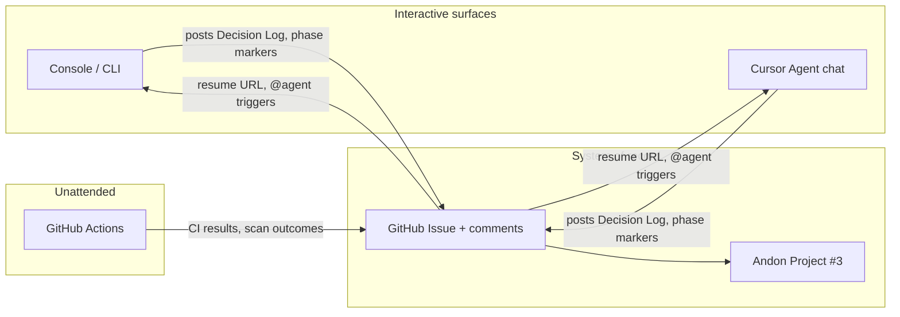

# ADR-013 — Guided milestone orchestration from templates

**Status**: Accepted · 2026-05-18

## Context

Catalyst delivers platform and application work through a durable GitHub Issues
state machine ([ADR-001](ADR-001-github-issues-as-state-machine.md)), golden-path
API contracts ([ADR-007](ADR-007-catalyst-api-golden-paths.md)), and a six-gate
agentic operating contract ([ADR-011](ADR-011-catalyst-agentic-workflow.md)).
Operators and agents already know *how* to comment, transition labels, and open
PRs — but starting a **multi-issue milestone** (new module, product surface, or
API improvement) still requires manual assembly: picking labels, drafting Gherkin,
sequencing architecture review before implementation, and preserving decisions
across sessions.

The Senior Platform Engineer challenge brief ([`docs/references/challenge-brief.md`](../references/challenge-brief.md))
grades **AI-native development workflow** (20% rubric weight) on whether AI is a
*core collaborator* with agent configuration in-repo and evidence of assisted
iteration — not merely on the existence of static prompts. **Communication and
documentation** (10%) rewards design rationale and reconstructable history; milestone
orchestration makes both **repeatable** for net-new modules, products, and API
improvements rather than ad-hoc per chat session.

Gap analysis ([`docs/plans/challenge-gap-analysis.md`](../plans/challenge-gap-analysis.md))
maps related backlog items (#10 ADMIN agentic workflow, #11 Consumer agentic
workflow) as **optional** for submission; this ADR does not replace those issues
but defines the **canonical delivery spine** any future workflow framework must
implement. It is complementary to onboarding tracks ([ADR-012](ADR-012-onboarding-experience.md)):
onboarding wires *accounts and constructs*; milestone orchestration wires
*feature delivery episodes*.

## Decision

Adopt **guided milestone orchestration**: a version-controlled **milestone
template** instantiates a parent GitHub Issue (and optional child issues) on the
[Catalyst Andon](https://github.com/orgs/Cloud-Byte-Consulting/projects/3) project;
an operator walks delivery phases through a **console-first** interaction surface
while the **GitHub Issue** remains the **system of record** for audit, resume, and
board visibility. Cursor/Claude agent sessions and GitHub Actions participate as
secondary triggers that **read from and write back to** the same issue thread.
Human approval gates are explicit; automation never skips them.

### Interaction surfaces (recommended model)

Multiple channels can drive the same phase spine (below). They differ in who
initiates, latency, and ergonomics — not in the underlying state machine (ADR-001).

| Surface | Role | Strengths | Limitations |
|---|---|---|---|
| **Console / CLI (primary)** | Interactive walkthrough for engineers | Fast prompts, local repo context, `catalyst` knack CLI today; future `catalyst milestone start` wizard | Requires terminal + auth; not visible to non-engineers on the board until synced to issue |
| **GitHub Issue comments (system of record)** | Durable audit trail, resume URL, `@agent` handoff | ADR-001 comment history; `### Agent Decision Log`; phase transitions visible on Andon; structured templates (Context/Scope/Gherkin) per [`docs/issue-execution-gherkin-workflow-2026-05-13.md`](../issue-execution-gherkin-workflow-2026-05-13.md) | Slower for multi-step wizards; markdown discipline required |
| **Cursor Agent chat** | IDE-resident orchestration | Rules/skills (`.cursor/rules/`, `issue-execution-gherkin-workflow`) reference milestone template; same gates as ADR-011 | Session-bound unless agent posts comments each phase |
| **GitHub Actions** | Unattended or scheduled kickoff | `workflow_dispatch` (e.g. teardown, full test suite); issue-labeled triggers for `type/onboarding`, `type/deploy` | Poor fit for architecture approval; best for phases 5–7 after intent is frozen |
| **Score / composite action (optional, future)** | Customer-facing “start feature” from portal | Aligns with gap-analysis automation-service vision (`score-translator` skill) | Out of v1 scope; must still open parent issue + Decision Log comment |

**Recommendation (hybrid):**

1. **Console-first** for interactive milestone bootstrap and phase prompts (template
   pick, construct address, intent class, “continue to architecture review?”).
2. **Issue comments as system of record** — every material phase transition, Decision
   Log entry, `intent-judge` result, and peer-review disposition is posted to the
   tracking issue (parent or child per phase). CLI and Cursor sessions MUST call
   `gh issue comment` (or GitHub MCP equivalent) before advancing local state.
3. **Bidirectional sync** — a milestone session writes Decision Log + phase markers;
   an operator MAY resume from the issue URL alone (`gh issue view <N> --comments`)
   without the original IDE session. Issue body (Context/Scope/Gherkin) is edited only
   for durable spec changes; time-ordered narrative stays in comments.
4. **Cursor and Actions as peers** — same orchestration contract; neither replaces the
   issue thread. Actions SHOULD not merge PRs or skip human gates.

Example issue comment triggers (v1 convention, not yet automated):

```markdown
@agent milestone resume --phase 4 --parent #123
```

```markdown
### Agent Decision Log
**Phase**: 1 — Architecture review
**Model**: …
**Decision**: Proceed with ADR-013 amendment; no new construct tier.
**Next**: Fan out child issues per template `new-api-endpoint`.
```

#### Channel × phase matrix

Phases match the orchestration table below. **Primary** = preferred driver; **Record**
= must land on issue; **Optional** = allowed adjunct.

| Phase | Console / CLI | Issue comments | Cursor chat | GitHub Actions | Score / portal (future) |
|---|:---:|:---:|:---:|:---:|:---:|
| 0 — Template bootstrap | **Primary** | Record | Optional | Optional (label `type/feat`) | Optional |
| 1 — Architecture review | **Primary** | Record | **Primary** | — | — |
| 2 — Issue creation | **Primary** | Record | **Primary** | — | — |
| 3 — Intent validation | **Primary** | Record | **Primary** | — | — |
| 4 — Implementation | **Primary** | Record | **Primary** | — | — |
| 5 — Validation | Adjunct | Record | Adjunct | **Primary** (CI workflows) | — |
| 6 — Pre-PR peer review | Adjunct | Record | **Primary** | — | — |
| 7 — Security review | Adjunct | Record | Adjunct | **Primary** (secret scan, Trivy) | — |
| 8 — PR creation | **Primary** | Record | **Primary** | Optional (`workflow_dispatch` smoke) | — |



### Milestone templates

Templates live under `docs/milestones/templates/` (to be populated per template).
Each template defines:

| Field | Purpose |
|---|---|
| `template_id` | Stable slug (e.g. `new-api-endpoint`, `new-service-module`) |
| `title_pattern` | Issue title with `{construct_address}` / `{feature}` placeholders |
| `labels` | Initial `type/*`, `state/pending`, plus all five construct-address anchors (`tenant/*`, `env/*`, `lz/*`, `project/*`, `app/*`) per [STATE-MACHINE.md](STATE-MACHINE.md) |
| `body_sections` | Pre-filled `## Context`, `## Scope`, fenced `gherkin` AC skeleton |
| `child_issues` | Optional checklist of follow-on issues (IaC, service, docs) |
| `golden_path_hint` | When applicable, pointer to ADR-007 endpoint(s) |
| `approval_gates` | Which phases require `state/blocked-on-human` before continuing |

Instantiation SHOULD be CLI-driven (`catalyst milestone create --template …` or
`catalyst milestone start` wizard on the knack CLI in `clients/catalyst-cli/`);
v1 MAY fall back to documented manual copy plus agent guidance. CLI commands MUST
emit or reference the parent issue URL immediately after bootstrap.

### Orchestration phases (mapped to Catalyst process)

Phases are **sequential gates**. Each phase ends with a structured issue comment
(per `docs/issue-execution-gherkin-workflow-2026-05-13.md`) and, where material,
an `### Agent Decision Log` entry ([ADR-011](ADR-011-catalyst-agentic-workflow.md)
gate 1). Board status follows ADR-001: `todo` → `in-progress` → `review` → `done`.

| Phase | Catalyst process step | Primary outputs | Human gate |
|---|---|---|---|
| **0 — Template bootstrap** | Milestone / epic issue creation | Parent issue + children on Andon; labels `state/pending` | Confirm template choice + scope |
| **1 — Architecture review** | Design / ADR alignment before code | Decision log; ADR draft or explicit "no ADR needed"; ADR-002 construct address validated | **Required** before issue fan-out |
| **2 — Issue creation** | Break work into trackable issues | Child issues with Context/Scope/Gherkin; dependencies via `Depends on #N` | Review issue set |
| **3 — Intent validation** | Pre-implementation scope check | `intent-judge` MCP `validate_intent` (`.cursor/rules/intent-judge.mdc`); ACCEPT/REJECT on tracking issue | REJECT → revise scope or escalate human |
| **4 — Implementation** | Agent execution per child issue | Commits; `state/agent-working`; model decision logs at material choices | `state/blocked-on-human` on scope/security surprises |
| **5 — Validation** | Tests, policy, coverage | `pr-checks.yml`: pytest `--cov-fail-under=85`; Terraform `fmt` + `validate`; TFLint; Checkov/Trivy (soft-fail); gitleaks. OPA via `validate-policies.yml` when `infrastructure/policy/opa/**` changes | Required checks green on PR |
| **6 — Pre-PR peer review** | ADR-011 gate 5 | Sub-agent review on tracking issue; ACCEPT/REJECT table | All ACCEPT resolved |
| **7 — Security review** | Secret scan + hardening | GitHub MCP `secret_protection` / `run_secret_scanning` (`.cursor/rules/github-secret-scanning.mdc`); Trivy/SBOM if container touched | Scan clean or documented exception |
| **8 — PR creation** | Open linked PR | PR body: Context, Scope, Gherkin AC, Agent Decision Log, peer-review disposition, Verification | Human merge (not agent-merge) |

**Terminal success**: parent issue records `pr_url`, `pr_merged=true`, children
`state/done` where applicable, parent transitions to `state/done`.

### Context carry-forward

Orchestration MUST preserve:

1. **Decision log chain** — model, rationale, alternatives on the parent issue;
   child issues reference parent `#N` in `### Context`.
2. **ADR corpus** — accepted ADRs in `docs/ADR/` are load-bearing; contradictions
   require a new ADR or PR scope change (ADR-011).
3. **Issue bodies** — Context/Scope/Gherkin remain source of truth for AC;
   agents do not re-derive scope from chat memory alone.
4. **RLM handoffs** — artifacts >50k chars use ADR-004 scaffold with
   `docs/rlm-issue-handoff-template.md` fields on the tracking issue.
5. **Intent signals** — `intent-judge` validation results posted before phase 4.

### Intent judging (deliverable classes)

Before phase 4, the orchestrating agent classifies user intent against template
`deliverable_class`:

| Class | Examples | Typical golden path / issues |
|---|---|---|
| `module` | New Terraform module, shared library | `type/deploy` + `type/test` children; ADR if new construct pattern |
| `product` | New service surface, multi-issue epic | Parent `type/feat`; Track C onboard if new app ([ADR-012](ADR-012-onboarding-experience.md)) |
| `api_improvement` | New/changed Catalyst API route | ADR-007 contract check; RBAC matrix ADR-008 |

Misclassified intent MUST transition to `state/blocked-on-human` with a proposed
re-scope comment — not silent replanning.

### Milestone fit vs challenge brief

| Brief rubric | Weight | How this ADR helps |
|---|---:|---|
| AI-native development workflow | 20% | Repeatable agent+human phase spine; in-repo templates and rules; open PR shows iteration |
| Communication and documentation | 10% | Issue thread + Decision Log reconstructs design without replaying IDE chat |
| Automation service (future) | 30% | Optional Score/portal surface; not required for ADR acceptance |
| CI/CD & Terraform | 25% + 15% | Phases 5–7 delegate to existing workflows (ADR-006); orchestration coordinates, does not replace |

Items #10 (ADMIN agentic workflow) and #11 (Consumer agentic workflow) in gap
analysis remain **optional** enhancements; this ADR is the **existing** canonical
spine they should implement, not an extra parallel process.

## Consequences

- **Repeatable AI-native delivery** — reviewers see the same phase spine on every
  milestone; interview narrative aligns with challenge brief §1 (AI as collaborator).
- **Audit trail by construction** — parent + child issues reconstruct architecture →
  merge without replaying IDE sessions (ADR-001, ADR-011).
- **Console + issue hybrid ops** — engineers get speed in the terminal; auditors and
  the Andon board get a single durable URL per milestone.
- **Template drift risk** — templates must be updated when STATE-MACHINE vocabulary
  or ADR-007 contracts change; owners: platform engineering + `adr-writer` skill.
- **Not a replacement for CI** — phases 5–7 still depend on `.github/workflows/`
  (ADR-006); orchestration coordinates gates, does not bypass them.
- **v1 is process + docs** — CLI `milestone` subcommands and `@agent` comment
  parsing are follow-on implementation; no mandatory new microservice until automation
  service rubric delivery (#18) lands.

## Alternatives considered

| Alternative | Why rejected |
|---|---|
| Chat-only orchestration (no templates) | Context does not survive session restarts; violates ADR-001 audit model. |
| Issue-comments-only (no CLI) | Works for audit but poor engineer UX for bootstrap and local repo coupling. |
| Console-only (no issue sync) | Breaks ADR-001/ADR-011 reconstructability and Andon visibility. |
| Backstage / Port developer portal wizard | ADR-005 and gap analysis §9 exclude portal for current phase. |
| Single mega-issue per milestone | Loses parallel child work, obscures done gates, breaks Andon visibility. |
| Skip intent-judge (trust prompt) | Heuristic gate is cheap; catches scope creep before expensive implementation. |
| Agent auto-merge PRs | Human merge preserves challenge/interview review story and branch protection. |
| New `phase/*` labels per orchestration step | ADR-001 and issue-execution doc use **project board columns** for workflow status; duplicate label vocabulary rejected. |

## Compliance

- All instantiated issues MUST include `## Context`, `## Scope`, and fenced
  `gherkin` acceptance criteria per [STATE-MACHINE.md](STATE-MACHINE.md) and
  ADR-001 §Decision point 5.
- Orchestrating agents MUST follow [ADR-011](ADR-011-catalyst-agentic-workflow.md):
  model decision logging, RLM at ~50k chars, OIDC-only AWS, container security gate,
  mandatory pre-PR peer review, GitHub MCP secret scanning before `pr_merged`.
- Construct addresses and RBAC MUST validate per [ADR-002](ADR-002-construct-hierarchy.md)
  and [ADR-008](ADR-008-catalyst-api-rbac.md) before Tier 2 golden-path calls.
- CLI and Cursor drivers MUST post phase outcomes to the tracking issue before
  claiming phase completion locally.
- Significant milestones SHOULD use `type/feat` or `type/chore` parent issues;
  platform-only milestones MAY use `type/onboarding` when aligned with ADR-012.
- Template or interaction-surface changes that alter gate order REQUIRE an ADR
  amendment or superseding ADR.

## Related

- [ADR-001](ADR-001-github-issues-as-state-machine.md) — Issues + Projects as state machine
- [ADR-007](ADR-007-catalyst-api-golden-paths.md) — Golden path API contracts
- [ADR-011](ADR-011-catalyst-agentic-workflow.md) — Six-gate agentic workflow
- [ADR-012](ADR-012-onboarding-experience.md) — Platform/org/app onboarding tracks
- [STATE-MACHINE.md](STATE-MACHINE.md) — Label and transition vocabulary
- [`docs/references/challenge-brief.md`](../references/challenge-brief.md) — Rubric (AI-native 20%, communication 10%)
- [`docs/plans/challenge-gap-analysis.md`](../plans/challenge-gap-analysis.md) — Issues #10, #11, #18
- [`docs/issue-execution-gherkin-workflow-2026-05-13.md`](../issue-execution-gherkin-workflow-2026-05-13.md) — Comment shape
- [`docs/rlm-issue-handoff-template.md`](../rlm-issue-handoff-template.md) — RLM handoff fields
- `.cursor/rules/intent-judge.mdc` — Intent validation rule
- `.cursor/rules/github-secret-scanning.mdc` — Secret scanning gate
- `clients/catalyst-cli/` — knack-based `catalyst` CLI (future `milestone` command group)
- `AGENTS.md` — Operating contract (gates 1–6)
