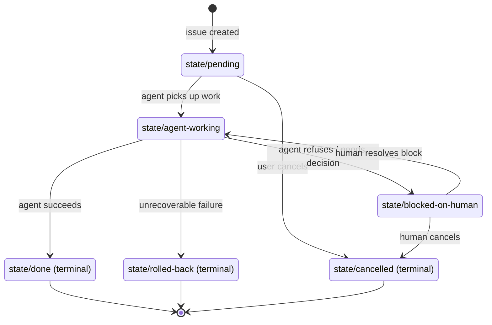

# STATE-MACHINE — the formal spec for Catalyst's GitHub Issues state machine

> ADR-001 documents the *decision* that GitHub Issues are the state
> machine. This file is the *spec*. Authoritative source of truth for the
> label vocabulary, legal transitions, ownership semantics, and audit
> conventions. Every Catalyst service implements these rules
> (`*/state_machine.py`); this doc is what they implement.
>
> **Citation**: Jones, Nate B. *"AI agents are about to route around every
> tool that can't pass 5 structural tests."* `natesnewsletter`, 2026-05-02.

---

## 1. The five-property substrate (recap)

Every automated work item in Catalyst MUST have all five:

| Property | Where it lives |
|---|---|
| **Persistent state** | The Issue body + labels (durable, queryable, queryable across runs) |
| **Defined state machine** | The `state/*` label set with explicit transitions (this doc) |
| **Ownership** | The Issue's `assignees` field (bot user when agent-working; human(s) when blocked) |
| **Defined verbs** | A small, named set of actions: `create`, `comment`, `assign`, `label`, `close`. No "sort of" transitions. |
| **Audit history** | Issue timeline + comments. Every state transition emits a comment summarising what happened. |

If a future automation can't fit all five, it isn't a Catalyst automation —
it's something else, and it needs its own spec.

## 2. Label vocabulary

Labels are **prefix-namespaced**. A given Issue MUST carry exactly one label
from each *exclusive* group it qualifies for, and MAY carry zero or more
from each *additive* group.

> every Catalyst-managed Issue MUST also
> carry the five **construct-address anchor labels** (`tenant/*`, `env/*`,
> `lz/*`, `project/*`, `app/*`) that identify the
> Tenant → Environment → LandingZone → Project → Application this work
> belongs to. See `docs/CONSTRUCT-SCHEMA.md` §4 for the spec; see
> `services/catalyst-api/catalyst/models/constructs.py::ConstructAddress`
> for the parser and `from_github_labels` validator.

### 2.1 State labels (exclusive — exactly one always present)

| Label | Meaning | Initial? | Terminal? |
|---|---|:---:|:---:|
| `state/pending` | Created but not yet picked up by an agent | ✅ | |
| `state/agent-working` | Catalyst agent is actively processing | | |
| `state/blocked-on-human` | Agent has refused; needs a human decision | | |
| `state/done` | Completed successfully | | ✅ |
| `state/rolled-back` | Failed; rollback applied | | ✅ |
| `state/cancelled` | User-cancelled before completion | | ✅ |

### 2.2 Type labels (exclusive — exactly one)

| Label | Type of work |
|---|---|
| `type/deploy` | Blue/green or canary deployment of a service |
| `type/secret-rotation` | Secrets Manager rotation event (request or run) |
| `type/preview-env` | Ephemeral preview-environment lifecycle |
| `type/pr-review` | AI PR review run (one Issue per PR) |
| `type/ops-intel-finding` | Single finding from the ops-intel scanner suite |
| `type/ops-intel-digest` | Weekly aggregation digest |
| `type/incident` | Live operational incident — Hansei target post-resolution |
| `type/kaizen` | Continuous improvement — one standardised-work change (Hansei → change → leading indicator); canonical log lives in Issues |

### 2.2.1 `type/kaizen` — construct defaults

Repository-wide standards (docs, CI gates, agent contract) use this fixed anchor set unless the kaizen is clearly tenant- or app-scoped (then replace labels accordingly):

| Label | Meaning for `type/kaizen` |
|---|---|
| `tenant/catalyst` | Platform / repo operator scope |
| `env/shared` | Not environment-specific delivery |
| `lz/shared` | Not landing-zone–specific |
| `project/platform` | Platform engineering surface |
| `app/kaizen` | Meta work item (the kaizen itself) |

### 2.3 Subtype labels (additive — zero or more)

For `type/deploy`:
- `deploy/blue-green` — uses CodeDeploy blue/green
- `deploy/canary` — uses CodeDeploy alias-shifting
- `deploy/all-at-once` — only for non-prod, never enabled in prod via OPA

For `type/ops-intel-finding`:
- `ops-intel/s3-encryption`
- `ops-intel/iam-usage`
- `ops-intel/cw-ingestion`
- `ops-intel/gha-history`
- `ops-intel/resource-inventory`

For `type/preview-env`:
- `preview/ephemeral`
- `preview/extended` — manually approved >72h life

### 2.4 Severity labels (additive, primarily for `type/ops-intel-finding`)

- `severity/critical`
- `severity/high`
- `severity/medium`
- `severity/low`
- `severity/info` (typically unlabelled — info-level findings don't open issues)

### 2.5 Verdict labels (additive — set on completion of `type/pr-review`)

- `verdict/approve`
- `verdict/comment`
- `verdict/request-changes`

### 2.6 Modifier labels (additive — flags for special handling)

- `policy-fail` — a CI policy gate denied; `state/blocked-on-human` companion
- `secrets-scrubbed` — pre-redaction scrubber found and replaced ≥1 secret
- `prompt-injection-attempted` — Bedrock output indicated injection attempt
- `auto-rollback-armed` — deployment has automatic-rollback alarms wired
- `budget-exhausted` — daily token budget hit; review skipped
- `kaizen-target` — flagged as a candidate for a **`type/kaizen`** Issue (or follow-up on an existing one)

## 3. Legal state transitions



Legal-transition table (machine-readable equivalent):

| From | → | To |
|---|---|---|
| `state/pending` | → | `state/agent-working`, `state/cancelled` |
| `state/agent-working` | → | `state/done`, `state/blocked-on-human`, `state/rolled-back` |
| `state/blocked-on-human` | → | `state/agent-working`, `state/cancelled` |
| `state/done` | → | (terminal) |
| `state/rolled-back` | → | (terminal) |
| `state/cancelled` | → | (terminal) |

**Any other transition is illegal** and raises `IllegalTransitionError`.

## 4. The verbs — exact semantics

The agent's interaction surface with GitHub is restricted to these verbs.
No other GitHub APIs are called from automation paths.

| Verb | What it does | Who can do it |
|---|---|---|
| **create** | `POST /repos/.../issues` — creates a new tracking Issue with type label and `state/pending`; issue is moved to board status `todo`; auto-assigns to configured project board when backend supports it | catalyst-api (user-initiated requests), webhook-handler (PR events), ops-intel probes (findings) |
| **comment** | `POST /repos/.../issues/{n}/comments` — appends to the audit trail. Mandatory after every state transition with a 1-line summary. | All Catalyst services |
| **assign** | `POST /repos/.../issues/{n}/assignees` — sets ownership. Bot self-assigns on `state/agent-working`; un-assigns on `state/blocked-on-human` (re-assigns to human reviewers if known). | All Catalyst services |
| **label** | `PATCH /repos/.../issues/{n}` with labels — atomic add/remove. Validated against the legal-transition table client-side BEFORE the API call. | All Catalyst services |
| **close** | `PATCH /repos/.../issues/{n}` with `state: closed` and `state_reason`. Used only on terminal states. | All Catalyst services |

### 4.1 Issue body contract (required)

All newly created Catalyst-managed issues MUST include:

1. `## Context` section
2. `## Scope` section
3. `## Acceptance Criteria` section containing a fenced `gherkin` block with:
   - one `Feature:`
   - at least one `Scenario:`

This is machine-validated by issue tooling before issue creation.

### 4.2 Workflow status contract (project board columns)

In addition to `state/*` labels, execution workflow status MUST be tracked on
the project board via these status keys:

- `todo`: picked up and in discovery/planning
- `in-progress`: plan comment posted and execution underway
- `on-hold`: waiting on dependency or external unblocker
- `review`: execution complete and awaiting review
- `done`: completion/closed state

Legacy `phase/*` labels are deprecated. Workflow tooling ignores them and
strips them during updates so they cannot drive behavior.

### 4.3 Required execution comments

- When plan/discovery is complete, agent posts a plan comment before execution.
- During execution, any non-trivial decision must be recorded in a comment with decision rationale and decision labels.
- If waiting on dependency, agent posts an on-hold comment including `Depends on #N` where applicable.

## 5. Ownership semantics

| Issue state | Assignee MUST be |
|---|---|
| `state/pending` | unassigned OR a human (the requester); never the bot |
| `state/agent-working` | `catalyst-bot[bot]` (and only the bot) |
| `state/blocked-on-human` | one or more humans (typically the original requester + a SME) |
| `state/done` / `state/rolled-back` / `state/cancelled` | unchanged from prior state |

The agent self-assigns when transitioning to `agent-working` and un-assigns
itself when transitioning to `blocked-on-human` or `cancelled`. Re-
assignment to the requester on `blocked-on-human` is best-effort (we read
`requester_login` from the issue body's frontmatter and assign them).

## 6. Eventual consistency rules

Webhook-driven label updates propagate asynchronously. Components MUST:

- Read fresh state from GitHub at any **decision boundary** (before
  attempting a transition, before deciding to do work).
- Treat the local DDB cache as **read-through**, never write-through.
- Use **`If-Match: <ETag>`** style optimistic concurrency where the GitHub
  API supports it (most labels endpoints do not — fall back to "read latest
  state, validate, retry on conflict").
- On illegal-transition error: **stop, log, comment on the issue** with
  the conflict, do not retry-with-force. The illegal transition is a hansei
  trigger, not a retry case.

## 7. Audit conventions

Every state transition MUST be paired with a comment. The comment format:

```
## Catalyst — <transition name>

**From state**: `state/agent-working`
**To state**: `state/done`
**Actor**: catalyst-bot[bot]
**Run ID**: <ULID>
**Trace ID**: <X-Ray trace ID>
**Duration**: 14s
**Summary**: Blue/green deploy of catalyst-api → v2.4.0 completed. Listener
shifted in 4 minutes. Auto-rollback alarms armed for 30m bake.
```

For `type/pr-review` runs, the AI reviewer's findings are appended as
additional structured comments, one per finding, plus one synthesizer
summary comment.

For `type/ops-intel-finding`, the initial issue body contains:
- The finding (resource ARN, severity, evidence excerpt).
- The proposed remediation (concrete, kaizen-shaped — small standardised-
  work change).
- The probe run ID.

**Coding-agent and Cursor sessions** (work tracked on an Issue but not necessarily every label tick): use the structured comment log in [`docs/issue-execution-gherkin-workflow-2026-05-13.md`](../issue-execution-gherkin-workflow-2026-05-13.md) so later agents can resume from `### Next`, rationale, and verification without re-deriving intent. That format complements this section; **state transitions still require** the `## Catalyst — <transition name>` block above.

## 8. Closing rule

- An Issue is `close`d only on `state/done`, `state/rolled-back`, or
  `state/cancelled`.
- `state/done` is only legal after verification confirms tests passed, documentation was updated/created, and PR disposition is explicit:
  - `pr_required=true|false`
  - `pr_merged=true|false`
  - if `pr_required=true`, then `pr_merged=true`
  - optional `pr_url` SHOULD be logged in the completion comment for traceability
- `state_reason` MUST be `completed` for `state/done` and `state/cancelled`,
  and `not_planned` for `state/rolled-back`.
- Re-opening an Issue is **not allowed** for terminal-state issues. If new
  work emerges, open a new Issue and reference the old one with `Closes #N`
  / `Refs #N`.

## 9. Dependencies

Cross-issue dependencies use GitHub's native `#N` referencing in body or
comments:

- `Blocks #123` — this issue must complete before #123 can advance.
- `Depends on #456` — this issue can't advance until #456 is `state/done`.
- `Closes #789` — when this issue closes successfully, also close #789.

The webhook-handler validates `Depends on` before allowing
`state/pending → state/agent-working`. If a dependency is not yet
`state/done`, the transition is rejected with a comment naming the blocker.

## 10. The GitHub Project (board) — Catalyst Andon

A single GitHub Project (v2) named `Catalyst Andon` provides the visible
workflow machine. It is **automated**: the Project's "Auto-add" workflow adds
any new Issue with a `type/*` label, and workflow tooling moves cards using
the workflow status keys (`todo`, `in-progress`, `on-hold`, `review`, `done`).

Columns:

| Column | Backed by workflow status | Order |
|---|---|---|
| `Todo` | `todo` | 1 |
| `In Progress` | `in-progress` | 2 |
| `On Hold` | `on-hold` | 3 |
| `Review` | `review` | 4 |
| `Done` | `done` | 5 |

The Project board is the **andon**. SREs at 2 AM open the board, not a
custom UI.

## 11. Implementation index

| Component | File |
|---|---|
| Authoritative legal-transition table | `services/catalyst-api/catalyst/state_machine.py` |
| Webhook reactor (which transitions trigger which work) | `services/webhook-handler/src/router.py` |
| AI reviewer state-machine usage | `services/ai-pr-reviewer/src/state_machine.py` |
| Ops-intel finding-issue creation | `services/ops-intel/src/sink.py` |
| Terraform-managed label set + Project | `infrastructure/modules/composite/github-bootstrap/` |
| Runbook for label drift / illegal transition | `RUNBOOK.md` § "Catalyst-IllegalTransition" |

## 12. Open extension points

- **`type/kaizen`** — continuous improvement entries (canonical log). Uses
  default construct anchors for repo-wide standards (`docs/ADR/STATE-MACHINE.md`
  §2.2.1). Implemented: `.github/ISSUE_TEMPLATE/kaizen.yml`.
- **`type/incident`** — currently rare; expected to grow as Hansei
  artefacts. The state machine fits unchanged; adding a `severity/sev-1`
  modifier might be useful.
- **`type/onboarding`** — for service-onboarding wizard runs. Not yet
  implemented; same machine applies.
- **Cross-repo dependencies** — currently we restrict `Depends on` to
  same-repo. Cross-repo would require enumerating which repos the bot has
  access to — out of scope for v1.

## 13. Update cadence

Changes to the label vocabulary or transition table land via PR like any
other code change. The PR MUST update:

1. This file.
2. Every `state_machine.py` in `services/*/`.
3. The Terraform module that manages the label set
   (`infrastructure/modules/composite/github-bootstrap/`).
4. A **`type/kaizen`** GitHub Issue if the change is a kaizen target (or extend an existing one).

A CI policy (`policy/opa/state_machine.rego`) asserts these stay in sync.

Last reviewed: 2026-05-08.
