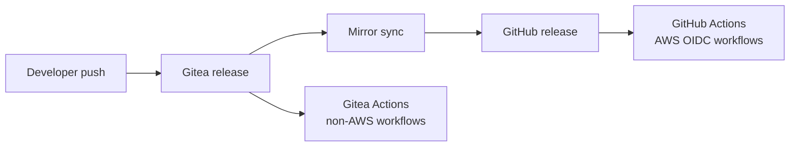

# Workflow migration matrix — Gitea Actions vs GitHub Actions

Under [ADR-021](../ADR/ADR-021-migration-github-to-gitea.md), CI is **split**:

- **Gitea Actions** — workflows with **no AWS OIDC** (or optional OIDC disabled).
- **GitHub Actions** — workflows that call `aws-actions/configure-aws-credentials` with GitHub OIDC JWT subjects until Gitea issuer trust is designed.

Source inventory: [`.github/workflows/README.md`](../../.github/workflows/README.md) · [ADR-006](../ADR/ADR-006-cicd-pipeline-architecture.md).

Tracked in [#246](https://github.com/Cloud-Byte-Consulting/Catalyst/issues/246).

---

## Summary matrix

| Workflow | AWS OIDC | Target forge | Priority | Notes |
|---|---|---|---|---|
| `pr-checks.yml` | No | **Gitea** | Migrate now | fmt, validate, TFLint, tfsec, Checkov, Trivy, gitleaks, pytest |
| `validate-policies.yml` | No | **Gitea** | Migrate now | `conftest verify` on OPA bundle |
| `multi-tool-sync.yml` | No | **Gitea** | Migrate now | `platform/bootstrap.py --check` |
| `full-suite.yml` | No | **Gitea** | Migrate now | Manual dispatch; mirrors pr-checks without path filter |
| `bootstrap-smoke.yml` | Optional | **Gitea** (script job) | Migrate now | Port syntax/pytest jobs; **skip** live AWS validation job until Gitea OIDC |
| `ci-smoke.yml` | Optional | **GitHub** | Stay | `.github/**` changes; optional STS check |
| `terraform.yml` | **Yes** | **GitHub** | Stay | Plan/apply; JWT `sub` = `repo:OWNER/REPO:...` |
| `tf-drift.yml` | **Yes** | **GitHub** | Stay | Scheduled drift + SNS |
| `service-cd.yml` | **Yes** | **GitHub** | Stay | ECR push + Lambda/ECS deploy |
| `teardown.yml` | **Yes** | **GitHub** | Stay | Manual destroy gate |
| `teardown-scheduled.yml` | **Yes** | **GitHub** | Stay | Scheduled EOD teardown |

---

## Migrate now (Phase 1b)

Port to `.gitea/workflows/` with Gitea Actions syntax (GitHub Actions–compatible subset):

1. `validate-policies.yml`
2. `multi-tool-sync.yml`
3. `pr-checks.yml`
4. `full-suite.yml`
5. `bootstrap-smoke.yml` — **jobs without** `id-token: write` / `configure-aws-credentials` only

Workflows live in [`.gitea/workflows/`](../../.gitea/workflows/) — see [README](../../.gitea/workflows/README.md).

### Gitea prerequisites

- [ ] Gitea Actions enabled on instance
- [ ] At least one `ubuntu-latest` (or `ubuntu-22.04`) runner registered
- [ ] Repository secrets mirrored (non-AWS):

| Secret / var | Used by | Required on Gitea |
|---|---|---|
| _(none for core lint/test jobs)_ | pr-checks, validate-policies, multi-tool-sync | No AWS secrets |
| `CODECOV_TOKEN` | pr-checks (if enabled) | Optional |

---

## Stay on GitHub (until Gitea OIDC trust)

These workflows **must run against the GitHub mirror** so JWT subjects match bootstrap IAM trust:

```
repo:Cloud-Byte-Consulting/Catalyst:pull_request
repo:Cloud-Byte-Consulting/Catalyst:ref:refs/heads/release
```

### Blockers for Gitea OIDC migration

1. Gitea Actions OIDC issuer URL and JWT claims documented
2. IAM trust policies for `catalyst-github-{plan,apply,deploy,drift}` extended (or parallel Gitea roles)
3. `BOOTSTRAP_GITHUB_REPOSITORY` equivalent for Gitea repo slug
4. Mirror latency acceptable for release deploys

Design spike tracked as Phase 3 continuation — **not blocking Phase 1b**.

---

## Trigger model under hybrid



- **PR checks on Gitea PRs** → Gitea Actions (`pr-checks`, etc.).
- **Release deploy to AWS** → requires GitHub mirror updated → GitHub `terraform.yml` / `service-cd.yml`.

---

## Path filters

Preserve path filters from `.github/workflows/` when porting. Gitea Actions supports `paths` / `paths-ignore` in `on:` triggers analogous to GitHub.

---

## Validation after port

```bash
# Local structural checks (forge-agnostic)
pip install pyyaml pytest
python .github/scripts/validate_workflows.py
pytest .github/scripts/test_workflow_structure.py -v
```

Re-run on `.gitea/workflows/` once ported; extend validator if needed in a follow-up PR.
