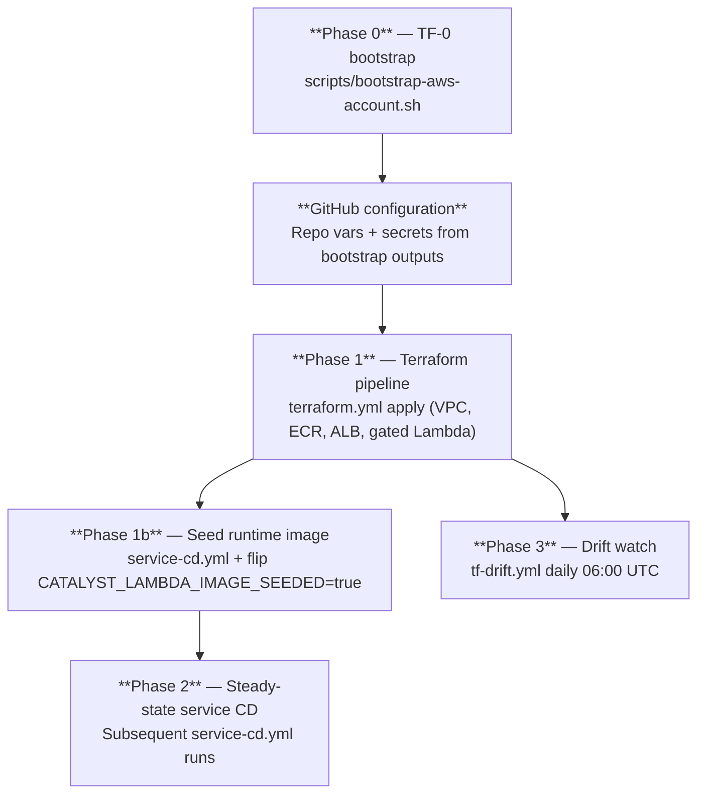

# Track A — Platform onboarding (operator)

**Audience:** Cloud / platform engineer deploying Catalyst into a fresh AWS account.
**Outcome:** Account ready for GitOps, Catalyst API reachable from allowlisted networks.
**Architectural decision:** [ADR-012](../ADR/ADR-012-onboarding-experience.md).
**Step-by-step:** [`docs/operator-bootstrap.md`](../operator-bootstrap.md) is the canonical sequence.

This document is the **overview**; the linked operator-bootstrap runbook is the **detail**. Read this first to understand the phases, then follow the operator-bootstrap steps for the actual commands.

## What you need before starting

| Item | Why | Where to get it |
|---|---|---|
| AWS account ID | Targets bootstrap state bucket + role ARNs | `aws sts get-caller-identity --query Account --output text` |
| AWS region | Catalyst is region-bound (single-region deployment) | Decision: us-east-1 / us-west-2 / etc. |
| GitHub repository (`owner/repo`) | Trusted for OIDC role assumption | The repo you're deploying from |
| `BOOTSTRAP_ADMIN_PRINCIPAL_ARN` | An existing IAM principal allowed to assume the bootstrap-admin role | Your IAM user/role, a break-glass role, or — day-0 only — `account:root` |
| AWS CLI v2 + active credentials | Provisions IAM, S3, DynamoDB during bootstrap | `aws --version` ≥ 2, `aws sts get-caller-identity` succeeds |
| Python 3.12 + Bash (or PowerShell on Windows) | Bootstrap script + workflow tests | `python --version` ≥ 3.12 |

## Phase ordering (one-time per account)



## The five-minute summary

1. **Run bootstrap once** — `scripts/bootstrap-aws-account.sh` provisions OIDC, IAM roles, RBAC groups, state bucket, lock table, API-data bucket. **Out of Terraform state by design.**
2. **Wire GitHub** — set `BOOTSTRAP_*` variables and `AWS_ROLE_{PLAN,APPLY,DEPLOY,DRIFT}_ARN` secrets from bootstrap outputs.
3. **Apply Phase 1** — merge an infra PR to `release`; `terraform.yml` runs apply. Lambda is gated by `var.lambda_image_seeded` so the first apply doesn't fail on a missing image.
4. **Seed the image** — dispatch `service-cd.yml`; once `:latest` exists in ECR, flip `CATALYST_LAMBDA_IMAGE_SEEDED=true` and re-run `terraform.yml`.
5. **Add your IP to the allowlist** — `CATALYST_API_INGRESS_ALLOWLIST` is a JSON array; the ALB security group restricts ingress to those CIDRs.

For the actual commands, secret values, and verification at each step, follow **[`docs/operator-bootstrap.md`](../operator-bootstrap.md)** § Step 1 through Step 7.

## Cost considerations

The network module accepts a `cost_tier` variable (`dev | prod | hipaa`, default `dev`) in `infrastructure/modules/network/variables.tf`. A 2-AZ VPC sitting idle costs ~$73/month today (~$66 NAT + ~$7 public IPv4 attached to the two NAT EIPs, per AWS public-IPv4 pricing in effect since 2024-02-01); future interface VPC endpoints would add ~$7.30/month each per AZ if not gated by `cost_tier`.

**Today (demo deployment path):** the root `infrastructure/` Terraform does not yet propagate `cost_tier` into `module.network`, so the default value (`dev`) applies. No operator action is required at the demo level.

**Future (per-tenant deployment path, lands with #168/#167):** when the tenant-onboarding composite becomes the entry point, `cost_tier` is set alongside `compliance_tier`:

- **Demo Mon-Fri auto-teardown stack:** `cost_tier = "dev"` (default).
- **Steady-state production:** `cost_tier = "prod"`.
- **HIPAA / regulated workloads:** set `compliance_tier = "hipaa"` on the composite — Network Firewall is wired by the **composite's** `compliance_tier` (per ADR-010), **NOT** by the network module's `cost_tier`. The two variables travel together but answer different questions (cost gate vs. compliance posture).

See [`docs/cost-model.md`](../cost-model.md) for the per-tier dollar table and the PR #151 orphan-VPC incident that motivated the convention.

## Bootstrap scope (what the script does — and doesn't)

**Provisions:**

- GitHub OIDC identity provider (dual-thumbprint tolerant)
- IAM roles: `catalyst-github-{plan,apply,deploy,drift}`, plus `catalyst-bootstrap-admin`
- Global RBAC groups: `catalyst-{owners,administrators,viewers,support-admins,support-operators,support-viewers,breakglass}` per [ADR-008](../ADR/ADR-008-catalyst-api-rbac.md)
- S3 state bucket: `{prefix}-tf-state-{account}-{region}` (default prefix `catalyst`)
- DynamoDB lock table: `{prefix}-terraform-locks`
- S3 API-data bucket: `{prefix}-api-data-{account}-{region}`

**Does NOT provision (use Terraform pipeline instead):**

- VPC, subnets, NAT, VPC endpoints
- Security groups (including the ALB ingress allowlist)
- ECR repository for the Catalyst API image
- ALB, listener, target group
- Lambda runtime (gated; see Phase 1b)
- Platform DynamoDB tables (per-tenant catalog, idempotency, etc.)
- Network Firewall (compliance tier, ADR-010)

Adding **new platform-wide AWS resource types** is always a Terraform PR — never an extension to the bootstrap script.

## Narrowing the bootstrap-admin principal

**Why this matters.** [ADR-008](../ADR/ADR-008-catalyst-api-rbac.md) assumes the bootstrap admin is a **scoped IAM principal**, not the account root. Leaving `BOOTSTRAP_ADMIN_PRINCIPAL_ARN=arn:aws:iam::<account>:root` in place after day-0 means any compromise of root credentials is also a compromise of the Catalyst RBAC plane. `scripts/bootstrap-aws-account.sh` will emit a `[WARN]` (non-blocking) when it detects an `account:root` principal so operators can't silently ship that posture into production.

**What to do post-bootstrap.**

1. Create a dedicated break-glass IAM role in the same account — e.g. `catalyst-bootstrap-breakglass` — assumable only by your identity-provider's break-glass group, with MFA required.
2. Attach the minimal inline policy below: `iam:*` scoped to the three Catalyst RBAC groups (`catalyst-owners`, `catalyst-administrators`, `catalyst-viewers`). The full per-group action matrix lives in [ADR-008](../ADR/ADR-008-catalyst-api-rbac.md).
3. Update `BOOTSTRAP_ADMIN_PRINCIPAL_ARN` (env var, GitHub repo var, and any `.env` file) to that role's ARN and re-run `scripts/bootstrap-aws-account.sh`. The script is idempotent — re-running rotates the trust policy on `catalyst-bootstrap-admin` to the new principal.

**Suggested policy shape** (minimal — see ADR-008 for the full matrix):

```json
{
  "Version": "2012-10-17",
  "Statement": [
    {
      "Sid": "ManageCatalystRBACGroups",
      "Effect": "Allow",
      "Action": "iam:*",
      "Resource": [
        "arn:aws:iam::<account>:group/catalyst-owners",
        "arn:aws:iam::<account>:group/catalyst-administrators",
        "arn:aws:iam::<account>:group/catalyst-viewers"
      ]
    }
  ]
}
```

**Follow-up.** A dedicated Terraform module (`infrastructure/modules/iam-breakglass/`) will codify this role + policy so operators don't hand-roll it; that work is tracked as a separate follow-up to #166 and will land once an operator exercises the path end-to-end.

## Local validation (no AWS calls)

Before pushing infra changes, run these locally:

```bash
python .github/scripts/validate_workflows.py
pytest .github/scripts/test_workflow_structure.py scripts/tests/test_bootstrap_scripts.py -q

terraform -chdir=infrastructure init -backend=false
terraform -chdir=infrastructure fmt -recursive -check
terraform -chdir=infrastructure validate
terraform -chdir=infrastructure test
```

## Bootstrap locally (mutates AWS — operator only)

Requires AWS credentials that can create IAM, S3, and DynamoDB resources. The script is idempotent — re-running is safe:

```bash
export AWS_REGION=us-east-1
export AWS_ACCOUNT_ID="$(aws sts get-caller-identity --query Account --output text)"
export GITHUB_REPOSITORY=Cloud-Byte-Consulting/Catalyst
export BOOTSTRAP_ADMIN_PRINCIPAL_ARN=arn:aws:iam::${AWS_ACCOUNT_ID}:role/YourBreakGlassRole

bash scripts/bootstrap-aws-account.sh --dry-run \
  --region "$AWS_REGION" \
  --account-id "$AWS_ACCOUNT_ID" \
  --github-repository "$GITHUB_REPOSITORY" \
  --bootstrap-admin-principal-arn "$BOOTSTRAP_ADMIN_PRINCIPAL_ARN"

# Live (remove --dry-run after reviewing dry-run output)
bash scripts/bootstrap-aws-account.sh \
  --region "$AWS_REGION" \
  --account-id "$AWS_ACCOUNT_ID" \
  --github-repository "$GITHUB_REPOSITORY" \
  --bootstrap-admin-principal-arn "$BOOTSTRAP_ADMIN_PRINCIPAL_ARN"
```

On Windows, the equivalent is `scripts/bootstrap-aws-account.ps1`. The script handles Git Bash / MSYS path conversion automatically (see PR #151).

## CI validation path

`bootstrap-smoke.yml` runs on PRs touching `scripts/bootstrap-aws-account.*`. For live AWS validation, dispatch it manually with `run_aws_validation: true` and the `Catalyst` environment configured (see [`.github/workflows/bootstrap-smoke.yml:63`](../../.github/workflows/bootstrap-smoke.yml) — this is one of the only places we use the GitHub Environment binding; Terraform workflows MUST NOT per ADR-012).

## After bootstrap completes — pipeline prerequisites checklist

1. **Set repository variables:** `BOOTSTRAP_AWS_ACCOUNT_ID`, `BOOTSTRAP_AWS_REGION`, `BOOTSTRAP_GITHUB_REPOSITORY`, `BOOTSTRAP_ADMIN_PRINCIPAL_ARN`, optional `BOOTSTRAP_CATALYST_PREFIX`, `CATALYST_API_INGRESS_ALLOWLIST`.
2. **Set repository secrets:** `AWS_ROLE_PLAN_ARN`, `AWS_ROLE_APPLY_ARN`, `AWS_ROLE_DEPLOY_ARN`, `AWS_ROLE_DRIFT_ARN`.
3. **Merge an infra PR** → confirm `terraform.yml` apply succeeded.
4. **Trigger `service-cd.yml`** → flip `CATALYST_LAMBDA_IMAGE_SEEDED=true`.
5. **Re-run `terraform.yml`** → Lambda is now attached to the ALB.
6. **Add your egress IP to `CATALYST_API_INGRESS_ALLOWLIST`** before smoke testing.

OIDC roles are used automatically. **Never** add static AWS keys to GitHub for Catalyst workflows — the structural validator at `.github/scripts/validate_workflows.py` enforces OIDC across every AWS-touching workflow (ADR-006).

## Verification

After Phase 2 completes, run the smoke-test runbook:

```bash
# From docs/smoke-tests.md Tier 1 — Tier 3
$albDns = aws elbv2 describe-load-balancers --names catalyst-alb --query 'LoadBalancers[0].DNSName' --output text
curl "http://$albDns/health"      # expect {"status":"ok"}
curl "http://$albDns/catalog"     # expect {"resources":[...], "role": ...}
```

See [`docs/smoke-tests.md`](../smoke-tests.md) for the full three-tier runbook (Lambda + ALB liveness, HTTP smoke, SigV4 authenticated paths).

## Anti-patterns (explicitly unsupported)

- Creating production VPC / ALB / Lambda in the AWS console "just once"
- Extending the bootstrap script for a new steady-state feature
- Application teams provisioning IAM roles outside `POST /services/onboard` or Terraform modules
- Calling AWS APIs from laptops with root credentials instead of group-scoped roles

## Next track

Once Track A is complete and verified, hand off to:

- [`organization.md`](./organization.md) for tenant / LZ / environment registration (Track B), or directly to
- [`application.md`](./application.md) for application-service onboarding (Track C) if Track B is already done.

## Related

- [ADR-012](../ADR/ADR-012-onboarding-experience.md) — onboarding decision
- [ADR-006](../ADR/ADR-006-cicd-pipeline-architecture.md) — CI/CD phase ordering
- [`docs/operator-bootstrap.md`](../operator-bootstrap.md) — canonical step-by-step
- [`docs/smoke-tests.md`](../smoke-tests.md) — post-onboarding verification
- [`docs/teardown.md`](../teardown.md) — environment teardown (Phase 0 preserved)
- [`.github/workflows/README.md`](../../.github/workflows/README.md) — variable + OIDC role mapping
