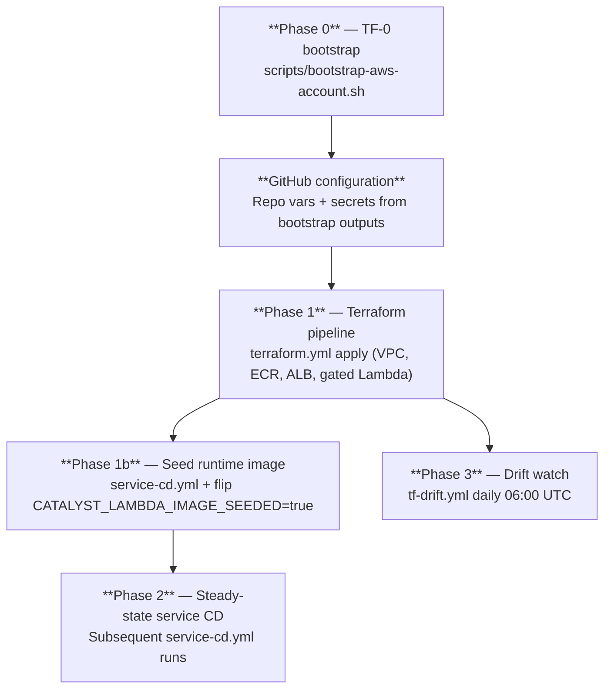
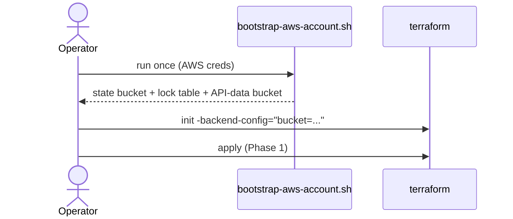

# Track A — Platform onboarding (operator)

**Audience:** Cloud / platform engineer deploying Catalyst into a fresh AWS account.
**Outcome:** Account ready for GitOps, Catalyst API reachable from allowlisted networks.
**Architectural decision:** [ADR-012](../ADR/ADR-012-onboarding-experience.md).
**Step-by-step:** [`docs/operator-bootstrap.md`](../operator-bootstrap.md) is the canonical sequence.

This document is the **overview**; the linked operator-bootstrap runbook is the **detail**. Read this first to understand the phases, then follow the operator-bootstrap steps for the actual commands.

## What you need before starting

| Item | Why | Where to get it |
|---|---|---|
| AWS account ID | Targets bootstrap state bucket + role ARNs | `aws sts get-caller-identity --query Account --output text` |
| AWS region | Catalyst is region-bound (single-region deployment) | Decision: us-east-1 / us-west-2 / etc. |
| GitHub repository (`owner/repo`) | Trusted for OIDC role assumption | The repo you're deploying from |
| `BOOTSTRAP_ADMIN_PRINCIPAL_ARN` | An existing IAM principal allowed to assume the bootstrap-admin role | Your IAM user/role, a break-glass role, or — day-0 only — `account:root` |
| AWS CLI v2 + active credentials | Provisions IAM, S3, DynamoDB during bootstrap | `aws --version` ≥ 2, `aws sts get-caller-identity` succeeds |
| Python 3.12 + Bash (or PowerShell on Windows) | Bootstrap script + workflow tests | `python --version` ≥ 3.12 |

## Phase ordering (one-time per account)



## The five-minute summary

1. **Run bootstrap once** — `scripts/bootstrap-aws-account.sh` provisions OIDC, IAM roles, RBAC groups, state bucket, lock table, API-data bucket. **Out of Terraform state by design.**
2. **Wire GitHub** — set `BOOTSTRAP_*` variables and `AWS_ROLE_{PLAN,APPLY,DEPLOY,DRIFT}_ARN` secrets from bootstrap outputs.
3. **Apply Phase 1** — merge an infra PR to `release`; `terraform.yml` runs apply. Lambda is gated by `var.lambda_image_seeded` so the first apply doesn't fail on a missing image.
4. **Seed the image** — dispatch `service-cd.yml`; once `:latest` exists in ECR, flip `CATALYST_LAMBDA_IMAGE_SEEDED=true` and re-run `terraform.yml`.
5. **Add your IP to the allowlist** — `CATALYST_API_INGRESS_ALLOWLIST` is a JSON array; the ALB security group restricts ingress to those CIDRs.

For the actual commands, secret values, and verification at each step, follow **[`docs/operator-bootstrap.md`](../operator-bootstrap.md)** § Step 1 through Step 7.

## Cost considerations

The network module accepts a `cost_tier` variable (`dev | prod | hipaa`, default `dev`) in `infrastructure/modules/network/variables.tf`. A 2-AZ VPC sitting idle costs ~$73/month today (~$66 NAT + ~$7 public IPv4 attached to the two NAT EIPs, per AWS public-IPv4 pricing in effect since 2024-02-01); future interface VPC endpoints would add ~$7.30/month each per AZ if not gated by `cost_tier`.

**Today (demo deployment path):** the root `infrastructure/` Terraform does not yet propagate `cost_tier` into `module.network`, so the default value (`dev`) applies. No operator action is required at the demo level.

**Future (per-tenant deployment path, lands with #168/#167):** when the tenant-onboarding composite becomes the entry point, `cost_tier` is set alongside `compliance_tier`:

- **Demo Mon-Fri auto-teardown stack:** `cost_tier = "dev"` (default).
- **Steady-state production:** `cost_tier = "prod"`.
- **HIPAA / regulated workloads:** set `compliance_tier = "hipaa"` on the composite — Network Firewall is wired by the **composite's** `compliance_tier` (per ADR-010), **NOT** by the network module's `cost_tier`. The two variables travel together but answer different questions (cost gate vs. compliance posture).

See [`docs/cost-model.md`](../cost-model.md) for the per-tier dollar table and the PR #151 orphan-VPC incident that motivated the convention.

## Bootstrap scope (what the script does — and doesn't)

**Provisions:**

- GitHub OIDC identity provider (dual-thumbprint tolerant)
- IAM roles: `catalyst-github-{plan,apply,deploy,drift}`, plus `catalyst-bootstrap-admin`
- Global RBAC groups: `catalyst-{owners,administrators,viewers,support-admins,support-operators,support-viewers,breakglass}` per [ADR-008](../ADR/ADR-008-catalyst-api-rbac.md)
- S3 state bucket: `{prefix}-tf-state-{account}-{region}` (default prefix `catalyst`)
- DynamoDB lock table: `{prefix}-terraform-locks`
- S3 API-data bucket: `{prefix}-api-data-{account}-{region}`

**Does NOT provision (use Terraform pipeline instead):**

- VPC, subnets, NAT, VPC endpoints
- Security groups (including the ALB ingress allowlist)
- ECR repository for the Catalyst API image
- ALB, listener, target group
- Lambda runtime (gated; see Phase 1b)
- Platform DynamoDB tables (per-tenant catalog, idempotency, etc.)
- Network Firewall (compliance tier, ADR-010)

Adding **new platform-wide AWS resource types** is always a Terraform PR — never an extension to the bootstrap script.

### Why bootstrap is a separate script (chicken-egg)

`terraform init` cannot wire up the S3 backend until the state bucket + lock table already exist, so the bucket that backs Terraform state cannot be safely created by the same configuration that consumes it. The bootstrap script therefore provisions the state bucket and lock table out-of-band, plus the shared API-data bucket so the first `terraform apply` doesn't fail on a missing data dependency. Re-running is idempotent, so the script is safe to execute again after partial failures or to provision newly-added shared resources.



See [`scripts/bootstrap-aws-account.sh`](../../scripts/bootstrap-aws-account.sh) for the provisioning logic and [ADR-015 §Backend-config generation strategy](../ADR/ADR-015-terraform-state-partitioning.md#backend-config-generation-strategy) for the per-tier `-backend-config` key naming convention.

## Narrowing the bootstrap-admin principal

**Why this matters.** [ADR-012](../ADR/ADR-012-onboarding-experience.md) §Consequences tolerates day-0 `account:root` for `BOOTSTRAP_ADMIN_PRINCIPAL_ARN` but requires it to be narrowed immediately after bootstrap. [ADR-008](../ADR/ADR-008-catalyst-api-rbac.md) defines the RBAC group/policy model the replacement principal must follow. Leaving `BOOTSTRAP_ADMIN_PRINCIPAL_ARN=arn:aws:iam::{account}:root` in place after day-0 means any compromise of root credentials is also a compromise of the Catalyst RBAC plane. `scripts/bootstrap-aws-account.sh` will emit a `[WARN]` (non-blocking) when it detects an `account:root` principal so operators can't silently ship that posture into production.

**What to do post-bootstrap.**

1. Create a dedicated break-glass IAM role in the same account — e.g. `catalyst-bootstrap-breakglass` — assumable only by your identity-provider's break-glass group, with MFA required.
2. Attach the minimal inline policy below — the allowlist matches [ADR-008](../ADR/ADR-008-catalyst-api-rbac.md)'s `CatalystOwnerPolicy` (`iam:AddUserToGroup`, `iam:RemoveUserFromGroup`, `iam:GetGroup`, `iam:ListGroupsForUser`) scoped to the three Catalyst RBAC groups (`catalyst-owners`, `catalyst-administrators`, `catalyst-viewers`). Not `iam:*` — the specific allowlist denies role creation, policy authoring, and cross-account trust by construction.
3. Update `BOOTSTRAP_ADMIN_PRINCIPAL_ARN` (env var, GitHub repo var, and any `.env` file) to that role's ARN and re-run `scripts/bootstrap-aws-account.sh`. The script is idempotent — re-running rotates the trust policy on `catalyst-bootstrap-admin` to the new principal.

**Suggested policy shape** (matches ADR-008's canonical `CatalystOwnerPolicy`):

```json
{
  "Version": "2012-10-17",
  "Statement": [
    {
      "Sid": "IamGroupManagement",
      "Effect": "Allow",
      "Action": [
        "iam:AddUserToGroup",
        "iam:RemoveUserFromGroup",
        "iam:GetGroup",
        "iam:ListGroupsForUser"
      ],
      "Resource": [
        "arn:aws:iam::{account}:group/catalyst-owners",
        "arn:aws:iam::{account}:group/catalyst-administrators",
        "arn:aws:iam::{account}:group/catalyst-viewers"
      ]
    }
  ]
}
```

This is the same policy ADR-008 attaches to `catalyst-owners`. Listing specific actions (rather than `iam:*`) limits the principal to group-membership management on exactly the three Catalyst RBAC groups — no role creation, no policy authoring, no cross-account trust.

**Follow-up.** A dedicated Terraform module (`infrastructure/modules/iam-breakglass/`) will codify this role + policy so operators don't hand-roll it; that work is tracked as a separate follow-up to #166 and will land once an operator exercises the path end-to-end.

## Local validation (no AWS calls)

Before pushing infra changes, run these locally:

```bash
python .github/scripts/validate_workflows.py
pytest .github/scripts/test_workflow_structure.py scripts/tests/test_bootstrap_scripts.py -q

terraform -chdir=infrastructure init -backend=false
terraform -chdir=infrastructure fmt -recursive -check
terraform -chdir=infrastructure validate
terraform -chdir=infrastructure test
```

## Bootstrap locally (mutates AWS — operator only)

Requires AWS credentials that can create IAM, S3, and DynamoDB resources. The script is idempotent — re-running is safe:

```bash
export AWS_REGION=us-east-1
export AWS_ACCOUNT_ID="$(aws sts get-caller-identity --query Account --output text)"
export GITHUB_REPOSITORY=Cloud-Byte-Consulting/Catalyst
export BOOTSTRAP_ADMIN_PRINCIPAL_ARN=arn:aws:iam::${AWS_ACCOUNT_ID}:role/YourBreakGlassRole

bash scripts/bootstrap-aws-account.sh --dry-run \
  --region "$AWS_REGION" \
  --account-id "$AWS_ACCOUNT_ID" \
  --github-repository "$GITHUB_REPOSITORY" \
  --bootstrap-admin-principal-arn "$BOOTSTRAP_ADMIN_PRINCIPAL_ARN"

# Live (remove --dry-run after reviewing dry-run output)
bash scripts/bootstrap-aws-account.sh \
  --region "$AWS_REGION" \
  --account-id "$AWS_ACCOUNT_ID" \
  --github-repository "$GITHUB_REPOSITORY" \
  --bootstrap-admin-principal-arn "$BOOTSTRAP_ADMIN_PRINCIPAL_ARN"
```

On Windows, the equivalent is `scripts/bootstrap-aws-account.ps1`. The script handles Git Bash / MSYS path conversion automatically (see PR #151).

## CI validation path

`bootstrap-smoke.yml` runs on PRs touching `scripts/bootstrap-aws-account.*`. For live AWS validation, dispatch it manually with `run_aws_validation: true` and the `Catalyst` environment configured (see [`.github/workflows/bootstrap-smoke.yml:63`](../../.github/workflows/bootstrap-smoke.yml) — this is one of the only places we use the GitHub Environment binding; Terraform workflows MUST NOT per ADR-012).

## Branch protection (`release`)

`release` is GitOps-protected by Terraform via [`infrastructure/branch-protection/`](../../infrastructure/branch-protection/), which wraps the [`infrastructure/modules/github`](../../infrastructure/modules/github/) module on top of the `integrations/github` provider's `github_branch_protection` resource. The rule requires ≥ 1 approving review, dismissal of stale reviews on push, all canonical CI checks green (`python-tests`, `cli-tests`, `Analyze (python)`, `terraform-quality`, `Terraform`, `cursor-config`, `conftest`, `workflow-structure`), a branch that is up-to-date with `release`, no force pushes, no deletions, and `enforce_admins = true`. See [ADR-006](../ADR/ADR-006-cicd-pipeline-architecture.md) for why this gate matters.

CI does **not** apply this root — it has its own sibling state key per [ADR-015](../ADR/ADR-015-terraform-state-partitioning.md). The operator applies it once:

```bash
cd infrastructure/branch-protection
export GITHUB_TOKEN=<fine-grained PAT with Administration: write on the repo>
terraform init -backend-config="bucket=<state-bucket-from-bootstrap>"
terraform apply
```

Re-apply whenever the contract changes (e.g. when [#200](https://github.com/Cloud-Byte-Consulting/Catalyst/issues/200) flips `actionlint` to required).

## Dependency updates

Dependabot is wired for `github-actions`, `pip` (api + cli), and `docker` via [`.github/dependabot.yml`](../../.github/dependabot.yml); the alert dashboard at <https://github.com/Cloud-Byte-Consulting/Catalyst/security/dependabot> is the operator's source of truth for outstanding vulnerabilities.

## After bootstrap completes — pipeline prerequisites checklist

1. **Set repository variables:** `BOOTSTRAP_AWS_ACCOUNT_ID`, `BOOTSTRAP_AWS_REGION`, `BOOTSTRAP_GITHUB_REPOSITORY`, `BOOTSTRAP_ADMIN_PRINCIPAL_ARN`, optional `BOOTSTRAP_CATALYST_PREFIX`, `CATALYST_API_INGRESS_ALLOWLIST`.
2. **Set repository secrets:** `AWS_ROLE_PLAN_ARN`, `AWS_ROLE_APPLY_ARN`, `AWS_ROLE_DEPLOY_ARN`, `AWS_ROLE_DRIFT_ARN`.
3. **Merge an infra PR** → confirm `terraform.yml` apply succeeded.
4. **Trigger `service-cd.yml`** → flip `CATALYST_LAMBDA_IMAGE_SEEDED=true`.
5. **Re-run `terraform.yml`** → Lambda is now attached to the ALB.
6. **Add your egress IP to `CATALYST_API_INGRESS_ALLOWLIST`** before smoke testing.

OIDC roles are used automatically. **Never** add static AWS keys to GitHub for Catalyst workflows — the structural validator at `.github/scripts/validate_workflows.py` enforces OIDC across every AWS-touching workflow (ADR-006).

## Verification

After Phase 2 completes, run the smoke-test runbook:

```bash
# From docs/smoke-tests.md Tier 1 — Tier 3
$albDns = aws elbv2 describe-load-balancers --names catalyst-alb --query 'LoadBalancers[0].DNSName' --output text
curl "http://$albDns/health"      # expect {"status":"ok"}
curl "http://$albDns/catalog"     # expect {"resources":[...], "role": ...}
```

See [`docs/smoke-tests.md`](../smoke-tests.md) for the full three-tier runbook (Lambda + ALB liveness, HTTP smoke, SigV4 authenticated paths).

## Operator alerts

The Catalyst platform publishes a CloudWatch dashboard plus five alarms via [`infrastructure/modules/observability/`](../../infrastructure/modules/observability/README.md) (5xx rate, request p99 latency, onboard p95 30-day trip-wire per [ADR-014](../ADR/ADR-014-services-onboard-provisioning-mode.md), transient-retry anomaly, AWS Lambda errors). All five fan out to one SNS topic, `${name_prefix}-alarms` (default `catalyst-alarms`).

**Subscribers are deliberately out-of-band** — issue [#63](https://github.com/Cloud-Byte-Consulting/Catalyst/issues/63) explicitly scopes "Out: PagerDuty/Slack integrations". The Terraform stops at the topic so on-call routing changes don't churn the infrastructure PR queue. Subscribe operator endpoints with `aws sns subscribe`:

```bash
TOPIC_ARN=$(terraform -chdir=infrastructure output -raw alarm_topic_arn)

# Email
aws sns subscribe --topic-arn "$TOPIC_ARN" --protocol email \
  --notification-endpoint operator@example.com   # confirm via inbox link

# PagerDuty (SNS integration on the service)
aws sns subscribe --topic-arn "$TOPIC_ARN" --protocol https \
  --notification-endpoint "https://events.pagerduty.com/integration/<key>/enqueue"

# Slack (via an SNS-to-Slack relay Lambda you provision separately)
aws sns subscribe --topic-arn "$TOPIC_ARN" --protocol lambda \
  --notification-endpoint "arn:aws:lambda:<region>:<account>:function:sns-to-slack"
```

**Dashboard:** the operator dashboard URL is the `dashboard_url` Terraform output. Bookmark it post-bootstrap and link it in your runbook.

## Autoscaling — verifying scaling activity (ECS runtime only)

When the ADR-009 ECS Fargate runtime is enabled (`enable_ecs_runtime = true`) **and** ECS autoscaling is opted in (`enable_ecs_autoscaling = true`), the `modules/ecs-autoscaling` sub-module registers an App Autoscaling target + two target-tracking policies on the catalyst-api ECS service. See [ADR-018](../ADR/ADR-018-ecs-autoscaling-strategy.md) for the strategy.

To verify the autoscaling surface is live and healthy:

**1. Target is registered:**

```bash
aws application-autoscaling describe-scalable-targets \
  --service-namespace ecs \
  --resource-ids service/<cluster-name>/<service-name>
```

The output should show `MinCapacity: 1`, `MaxCapacity: 6` (defaults) and `ScalableDimension: ecs:service:DesiredCount`.

**2. Both policies are attached:**

```bash
aws application-autoscaling describe-scaling-policies \
  --service-namespace ecs \
  --resource-id service/<cluster-name>/<service-name>
```

Expect two `TargetTrackingScaling` policies:
- One with `PredefinedMetricType: ECSServiceAverageCPUUtilization`, `TargetValue: 60`
- One with `PredefinedMetricType: ALBRequestCountPerTarget`, `TargetValue: 50`, plus a `ResourceLabel` matching `app/<alb-name>/<hex>/targetgroup/<tg-name>/<hex>`

**3. AWS-managed scaling alarms exist (auto-emitted by the policies):**

```bash
aws cloudwatch describe-alarms --alarm-name-prefix TargetTracking-
```

Expect four alarms (two per policy — one for scale-out, one for scale-in). These drive the scaling action internally; they are NOT routed to SNS.

**4. Supplemental alarms (the SNS-visible ones) exist:**

```bash
aws cloudwatch describe-alarms \
  --alarm-name-prefix catalyst-api- \
  --query "MetricAlarms[?contains(@.AlarmName, 'cpu-high') || contains(@.AlarmName, 'rpt-high') || contains(@.AlarmName, 'at-max-capacity')].[AlarmName,StateValue,AlarmActions[0]]" \
  --output table
```

Expect three alarms (`catalyst-api-cpu-high`, `catalyst-api-rpt-high`, `catalyst-api-at-max-capacity`), each with `AlarmActions` containing the `catalyst-alerts` SNS topic ARN from #63.

**5. Inspect recent scaling activity:**

```bash
aws application-autoscaling describe-scaling-activities \
  --service-namespace ecs \
  --resource-id service/<cluster-name>/<service-name> \
  --max-results 10
```

Each entry shows a scale-in or scale-out event with `Cause` ("monitor alarm ... in ALARM state") and `StatusCode: Successful`. An empty list means no scaling has occurred since the policies were registered (expected at steady state).

**HA trade-off reminder** (per ADR-018 §3): `min_capacity` defaults to **1** for cost. Production deployments that require HA must override `ecs_autoscaling_min_capacity = 2` (or higher) in their composite caller — at `min=1` the service has a brief unavailability window during task replacement, crash recovery, or AZ outages.

## Anti-patterns (explicitly unsupported)

- Creating production VPC / ALB / Lambda in the AWS console "just once"
- Extending the bootstrap script for a new steady-state feature
- Application teams provisioning IAM roles outside `POST /services/onboard` or Terraform modules
- Calling AWS APIs from laptops with root credentials instead of group-scoped roles

## Next track

Once Track A is complete and verified, hand off to:

- [`organization.md`](./organization.md) for tenant / LZ / environment registration (Track B), or directly to
- [`application.md`](./application.md) for application-service onboarding (Track C) if Track B is already done.

## Related

- [ADR-012](../ADR/ADR-012-onboarding-experience.md) — onboarding decision
- [ADR-006](../ADR/ADR-006-cicd-pipeline-architecture.md) — CI/CD phase ordering
- [`docs/operator-bootstrap.md`](../operator-bootstrap.md) — canonical step-by-step
- [`docs/smoke-tests.md`](../smoke-tests.md) — post-onboarding verification
- [`docs/teardown.md`](../teardown.md) — environment teardown (Phase 0 preserved)
- [`.github/workflows/README.md`](../../.github/workflows/README.md) — variable + OIDC role mapping
