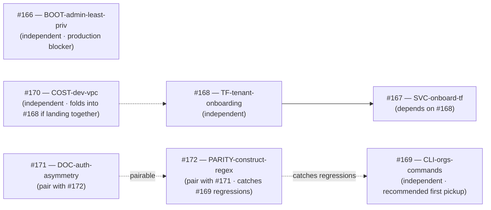

# Onboarding follow-up execution plan

**Tracking issue**: [#173](https://github.com/Cloud-Byte-Consulting/Catalyst/issues/173)
**Branch convention**: one `feat/<tag>-<issue#>` branch per issue (matches the CLI chain pattern from PRs #158-#161)
**Authoritative ADR**: [ADR-012](../ADR/ADR-012-onboarding-experience.md) — onboarding experience
**Contract**: [ADR-011](../ADR/ADR-011-catalyst-agentic-workflow.md) — the six-gate operating contract every PR must clear
**Status**: pending — awaiting first pickup (recommend #169)
**Last updated**: 2026-05-18

---

## Goal

Land all seven ADR-012 follow-up issues (#166-#172) without dependency-induced rework, in an order that maximizes momentum and clears the most critical security gap (#166) before any production deployment. Each issue ships as its own small PR following the AGENTS.md / ADR-011 contract.

This plan is **tactical** — it doesn't introduce new decisions. The architectural decisions are in [ADR-012](../ADR/ADR-012-onboarding-experience.md); the per-issue dependencies are in the sequencing-note comments on each of #166-#172. This document collapses those comments into a single sequenced view so a future pickup agent doesn't reconstruct the dependency graph.

---

## Inventory (7 issues + dependency graph)

| # | Title | Tier | Type | Estimated effort | Upstream blockers |
|---|---|---|---|---|---|
| [#166](https://github.com/Cloud-Byte-Consulting/Catalyst/issues/166) | `chore(bootstrap): replace BOOTSTRAP_ADMIN_PRINCIPAL_ARN root with least-privilege role` | T3 security | chore | 3-5 hr (doc + script tweak + optional TF module) | none |
| [#167](https://github.com/Cloud-Byte-Consulting/Catalyst/issues/167) | `feat(catalyst-api): Terraform-backed POST /services/onboard (replace stubbed ARNs)` | T4 feature | feat | 1-2 days | [#168](https://github.com/Cloud-Byte-Consulting/Catalyst/issues/168) |
| [#168](https://github.com/Cloud-Byte-Consulting/Catalyst/issues/168) | `feat(tf): tenant-onboarding composite module` | T4 feature | feat | 1 day | none |
| [#169](https://github.com/Cloud-Byte-Consulting/Catalyst/issues/169) | `feat(cli): add orgs command family (Tier 1 endpoints)` | T2 quick win | feat | 2-4 hr | none |
| [#170](https://github.com/Cloud-Byte-Consulting/Catalyst/issues/170) | `kaizen(cost): NAT + interface VPC endpoint cost review for dev VPCs` | T3 cost | kaizen | 4-6 hr | none (extends [#168](https://github.com/Cloud-Byte-Consulting/Catalyst/issues/168)) |
| [#171](https://github.com/Cloud-Byte-Consulting/Catalyst/issues/171) | `kaizen(docs): document client/server CATALYST_AUTH naming asymmetry in ADR-008` | T2 docs | kaizen | 30-60 min | none |
| [#172](https://github.com/Cloud-Byte-Consulting/Catalyst/issues/172) | `kaizen(test): parity test for CONSTRUCT_RE (CLI) and CONSTRUCT_PATTERN (server)` | T2 quick win | kaizen | 30-60 min | none |

### Dependency graph

---

## Recommended execution order

### Phase 1 — Quick wins to build momentum (≈4-6 hours total)

These three issues have no upstream blockers, ship in small PRs, and produce visible doc/test wins.

| Order | Issue | Why now |
|---|---|---|
| **1** | [#169](https://github.com/Cloud-Byte-Consulting/Catalyst/issues/169) — `feat(cli): orgs command family` | Removes the curl + boto3 workaround from `docs/onboarding/organisation.md`. Closes a doc TODO and finishes the CLI surface. |
| **2** | [#172](https://github.com/Cloud-Byte-Consulting/Catalyst/issues/172) — `kaizen(test): construct-regex parity test` | Catches a future regression where #169 (or any future change) extends the regex on one side without the other. Lands before #167 / #168 which both touch construct addresses. |
| **3** | [#171](https://github.com/Cloud-Byte-Consulting/Catalyst/issues/171) — `kaizen(docs): CATALYST_AUTH naming asymmetry` | Pairs with #172 (different surface, same review cadence). Clarifies the auth surface before #167 / #169 ship more code touching auth. |

**Optional chain pattern**: #171 + #172 can land as a single PR (different files, small total diff, single peer-review cycle). Or as a 2-PR chain like the CLI test improvement chain (PRs #158-#161).

### Phase 2 — Tenant-onboarding feature track (≈2-3 days total)

These are the substantive feature issues. They have a real dependency (#167 needs #168) so #168 must land first.

| Order | Issue | Why now |
|---|---|---|
| **4** | [#168](https://github.com/Cloud-Byte-Consulting/Catalyst/issues/168) — `feat(tf): tenant-onboarding composite module` | Unblocks #167. Self-contained Terraform module + tftest; reviewable in isolation. Optionally folds in [#170](https://github.com/Cloud-Byte-Consulting/Catalyst/issues/170)'s `cost_tier` variable if you want one PR instead of two. |
| **5** | [#170](https://github.com/Cloud-Byte-Consulting/Catalyst/issues/170) — `kaizen(cost): NAT + interface endpoint cost review` | Land standalone after #168, OR fold the `cost_tier` variable into #168 to save a review cycle. Either way: documents the cost-tier choice and adds the `docs/cost-model.md` doc. |
| **6** | [#167](https://github.com/Cloud-Byte-Consulting/Catalyst/issues/167) — `feat(catalyst-api): Terraform-backed POST /services/onboard` | The big one — wires the API to invoke #168's composite module. Replaces v1 stubbed ARNs with real provisioning. Large PR; consider sub-design-doc in the PR description for A vs B (sync Terraform vs async SQS+Lambda). |

### Phase 3 — Security hardening (independent, land before production)

| Order | Issue | Why now |
|---|---|---|
| **7** | [#166](https://github.com/Cloud-Byte-Consulting/Catalyst/issues/166) — `chore(bootstrap): least-privilege admin principal` | Pure security work. Independent of Phases 1-2. **MUST land before any production deployment** — demo account currently has `account:root` as bootstrap-admin trust. |

`#166` can actually be picked up at any time — slotted last here because it has no downstream impact and is the easiest to land "whenever". If a production deploy date appears, **move #166 to the top**.

---

## Per-issue execution kit

For each issue, this section lists what a pickup agent needs at their fingertips: scope, AC anchor, files they'll touch, contract gates that apply.

### #169 — `feat(cli): orgs command family` (Phase 1 · Order 1)

**Scope:** Add 5 sub-commands to `clients/catalyst-cli/catalyst_cli.py` wrapping Tier 1 endpoints. Update tests + `docs/onboarding/organisation.md`.

**Files to touch:**
- `clients/catalyst-cli/catalyst_cli.py` — new `orgs` command group + handler functions
- `clients/catalyst-cli/tests/test_catalyst_cli.py` — 5 new unit tests
- `clients/catalyst-cli/tests/test_auth_integration.py` — 1 new moto test verifying header forwarding
- `docs/onboarding/organisation.md` — replace curl examples with CLI examples; move curl to an "alternatives" appendix

**Contract gates that apply:**
- Coverage gate at 80% (from #154) — verify with `pytest --cov=catalyst_cli --cov-fail-under=80`
- Live-marker exclusion in pr-checks (from #157) — `-m 'not live'`
- AGENTS.md peer-review gate

**Pickup checklist:**
1. Branch from release: `git checkout origin/release -b feat/cli-orgs-commands-169`
2. Post Agent Decision Log on #169 before code
3. Read ADR-007 §Tier 1 for the endpoint contract
4. Read `clients/catalyst-cli/catalyst_cli.py` existing structure (services / catalog / groups / health)
5. Implement → test → peer-review sub-agent → PR

### #172 — `kaizen(test): construct-regex parity` (Phase 1 · Order 2)

**Scope:** New test in `services/catalyst-api/tests/` that asserts the client-side and server-side regex literals are byte-equal. AST-parse the CLI source; don't import it (would have side effects).

**Files to touch:**
- `services/catalyst-api/tests/test_construct_pattern_parity.py` (new)
- `clients/catalyst-cli/catalyst_cli.py` — one-line docstring addition noting the parity test
- `services/catalyst-api/catalyst/constructs.py` — one-line docstring addition noting the parity test

**Contract gates:**
- Coverage gate at 85% on the API side (already at 85%, doesn't move)
- Test must run in the existing `python-tests` CI job (no new workflow)

**Pickup checklist:**
1. Branch: `git checkout origin/release -b feat/parity-construct-regex-172`
2. Post Decision Log on #172
3. Read both regex literals — confirm they're equal today (test should pass at first run)
4. Implement → run pytest → peer-review → PR

### #171 — `kaizen(docs): CATALYST_AUTH naming asymmetry` (Phase 1 · Order 3)

**Scope:** Add a section to ADR-008 documenting that server-side `CATALYST_AUTH_MODE=sigv4` ↔ client-side `CATALYST_AUTH=presigned-sts` refer to the same flow. Update module docstrings.

**Files to touch:**
- `docs/ADR/ADR-008-catalyst-api-rbac.md` — new "Naming asymmetry" subsection
- `clients/catalyst-cli/catalyst_cli.py` — module-level docstring update
- `services/catalyst-api/catalyst/rbac.py` — module-level docstring update
- `docs/onboarding/organisation.md` + `docs/onboarding/application.md` — cross-link to the new ADR-008 section

**Contract gates:** doc-only; secret-scanning gate; peer-review gate.

**Pickup checklist:**
1. Branch: `git checkout origin/release -b feat/doc-auth-asymmetry-171`
2. Post Decision Log on #171
3. Read `rbac.py:144` to confirm the server-side env value
4. Implement → peer-review → PR

### #168 — `feat(tf): tenant-onboarding composite module` (Phase 2 · Order 4)

**Scope:** New composite Terraform module `infrastructure/modules/composite/tenant-onboarding/` accepting `tenant`, `landing_zone_account_id`, `compliance_tier`, `environments`. Provisions SSM tree + tenant-scoped IAM groups + per-env VPCs + optional Network Firewall.

**Files to touch:**
- `infrastructure/modules/composite/tenant-onboarding/` (new directory: `main.tf`, `variables.tf`, `outputs.tf`, `versions.tf`, `README.md`)
- `infrastructure/tests/tenant_onboarding.tftest.hcl` (new) — validates standard + hipaa tiers
- `docs/onboarding/organisation.md` — note the future Terraform path

**Contract gates:**
- Terraform fmt + validate + tflint + tfsec (existing pr-checks)
- ADR-010 compliance for Network Firewall conditional
- AGENTS.md peer-review gate

**Pickup checklist:**
1. Branch: `git checkout origin/release -b feat/tf-tenant-onboarding-168`
2. Post Decision Log on #168 with the chosen tier shape
3. Read `infrastructure/modules/composite/catalyst-product/` as the pattern reference (app-scoped composite)
4. Read ADR-002 + ADR-010 for the contract this module enforces
5. Implement → tftest → peer-review → PR

### #170 — `kaizen(cost): dev VPC cost tier` (Phase 2 · Order 5, or fold into #168)

**Scope:** Add `cost_tier` variable to `infrastructure/modules/network/` that conditionally provisions interface VPC endpoints. Add `docs/cost-model.md`.

**Files to touch:**
- `infrastructure/modules/network/{variables,main}.tf` — new `cost_tier` variable + `count` gating
- `infrastructure/tests/network.tftest.hcl` — extend with cost-tier cases
- `docs/cost-model.md` (new)
- `docs/onboarding/platform.md` — link the cost model

**Contract gates:** Terraform quality gates + peer-review gate. Module README updated with cost-tier semantics.

**Pickup checklist:**
1. Branch: `git checkout origin/release -b kaizen-cost-dev-vpc-170` — OR fold into the #168 branch
2. Decide standalone vs folded — note the choice in the Decision Log
3. Read `infrastructure/modules/network/main.tf` to find the endpoint resources
4. Implement → tftest → peer-review → PR

### #167 — `feat(catalyst-api): Terraform-backed POST /services/onboard` (Phase 2 · Order 6)

**Scope:** Wire `POST /services/onboard` to invoke the #168 composite (or a per-app derivative) instead of returning stubbed ARNs. Decide sync vs async; document the decision in a sub-section of the PR description.

**Files to touch:**
- `services/catalyst-api/catalyst/main.py` — onboard handler
- `services/catalyst-api/catalyst/onboard.py` (or new module) — provisioning orchestration
- `services/catalyst-api/tests/test_services.py` — extend with moto-mocked AWS assertions
- `docs/onboarding/application.md` — drop the "may return stubbed ARNs" caveat

**Contract gates:**
- 85% coverage on the API side (existing gate)
- AGENTS.md peer-review gate (PR is large enough that the sub-agent's review is especially valuable)
- Secret scanning

**Pickup checklist:**
1. Confirm #168 is merged
2. Branch: `git checkout origin/release -b feat/svc-onboard-tf-167`
3. Post Decision Log on #167 with the sync/async choice + design sketch
4. Read ADR-007 §Tier 2 + the v1 stub handler
5. Implement → moto tests → peer-review (mandatory; this is the largest PR in the plan) → PR

### #166 — `chore(bootstrap): least-privilege admin principal` (Phase 3 · Order 7, or pre-production whenever)

**Scope:** Doc + script-warning + optional Terraform break-glass module.

**Files to touch:**
- `docs/onboarding/platform.md` — new section "Narrowing the bootstrap-admin principal"
- `scripts/bootstrap-aws-account.sh` — add `[WARN]` when supplied principal is `account:root`
- `infrastructure/modules/iam-breakglass/` (optional, new) — canonical break-glass role module with MFA + 8h max session

**Contract gates:** secret-scanning (none expected, doc + script change), peer-review gate.

**Pickup checklist:**
1. Branch: `git checkout origin/release -b chore-boot-admin-166`
2. Decide: include the break-glass module or defer? Note in Decision Log
3. Read `scripts/bootstrap-aws-account.sh` § the ensure_role_with_trust function
4. Implement → optionally apply on the demo account to validate the procedure → peer-review → PR

---

## Cross-cutting conventions (every PR in the plan)

Each PR in this plan follows the same ADR-011 / AGENTS.md gates:

1. **Tracking issue first** — Decision Log posted before any code change
2. **Branch from release** — never branch from another open PR (we learned this the hard way in the CLI chain; see PR #153 rebase saga)
3. **Single-purpose PR** — one issue per PR; chain via merge-then-rebase, not stacked branches
4. **Pre-PR peer-review sub-agent** — mandatory (gate 5)
5. **Disposition table** — every suggestion ACCEPT or REJECT with rationale in PR body
6. **`Closes #N`** keyword in commit message — for GitHub auto-close on squash-merge
7. **Post-merge confirmation comment** on the closed issue (the convention established in the CLI chain)

## Risks + watchpoints

| Risk | Mitigation |
|---|---|
| #167 grows too large — sync vs async decision balloons into a multi-week design exercise | Time-box the design sketch in the Decision Log to 1 day. If A vs B isn't clear by then, ship A (sync) as v2 and file v3 for async — keep PR scope honest. |
| #168 + #170 conflict — if landed in parallel, both touch `infrastructure/modules/network/variables.tf` | Decide upfront: fold #170 into #168, OR land #168 first and rebase #170. |
| #166 forgotten — security debt accumulates | Add a `[SECURITY-TODO]` comment to `scripts/bootstrap-aws-account.sh` referencing #166 if it's not picked up within 2 weeks. |
| Construct-regex parity (#172) breaks because the CLI invokes `re.IGNORECASE` and the server doesn't | The parity test should normalize for flags. The implementing agent should verify both regexes use the same flag set; if they don't, that's the actual bug the test surfaces. |
| `cost_tier=dev` in #170 makes Lambda cold-start slower (egress via NAT instead of interface endpoints) | Document the latency trade-off in `docs/cost-model.md`. Recommend `cost_tier=prod` for any environment with SLAs. |

## Exit criteria for the plan

The plan is complete when:

1. Issues #166-#172 are all closed (via merge of their respective PRs)
2. `docs/cost-model.md` exists (from #170)
3. `docs/onboarding/organisation.md` no longer has the curl workaround section (from #169)
4. `docs/ADR/ADR-008-catalyst-api-rbac.md` has the naming-asymmetry section (from #171)
5. The construct-regex parity test runs in CI (from #172)
6. `POST /services/onboard` returns real ARNs (from #167 + #168)
7. `BOOTSTRAP_ADMIN_PRINCIPAL_ARN` on the demo account points at a non-root role (from #166 — operator action after the code change ships)

Update this section as issues close. When all seven boxes are checked, close #173 and archive the plan.

## Related

- [ADR-012](../ADR/ADR-012-onboarding-experience.md) — onboarding decision (source of the seven follow-ups)
- [ADR-011](../ADR/ADR-011-catalyst-agentic-workflow.md) — operating contract every PR must clear
- [`docs/onboarding/`](../onboarding/) — the runbook set this plan completes
- [PR #165](https://github.com/Cloud-Byte-Consulting/Catalyst/pull/165) — the merge that surfaced the seven follow-ups
- [PR chain pattern reference: PRs #158-#161](https://github.com/Cloud-Byte-Consulting/Catalyst/pulls?q=is%3Apr+is%3Aclosed+158..161) — the CLI test improvements that established the merge-then-rebase chain pattern
