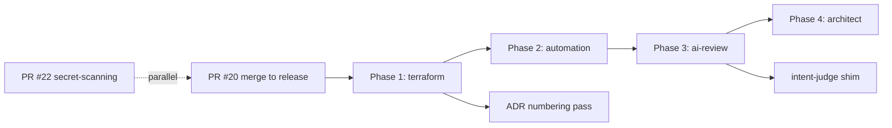

# Execution Plan — platform-catalyst Import

**Source of truth**: [`docs/research/platform-catalyst-agents-evaluation.md`](../research/platform-catalyst-agents-evaluation.md) (16 locked decisions, §5 import phases, §5.6 paths tree, §5.7 wiring).
**Date**: 2026-05-14 · **Owner**: maintainer · **Scope**: import 9 of 12 agents + ~30 skills + 1 rule + 1 MCP shim into `Catalyst/.cursor/`.

---

## 1. Executive summary

- **What's left**: 4 sequential phase PRs (terraform → automation → AI-review → architect) + 2 small follow-ups (intent-judge shim, ADR numbering pass). 0 of the 4 phase branches exist yet locally.
- **What's in flight**: PR #20 (`rc/aws-agentic-platform-engineering` → `release`, issue #19) and PR #22 (`rc/github-mcp-secret-scanning` → `release`, issue #21).
- **Hard dependency on PR #20**: per decision #1, no phase branch may be cut from `release` until #20 merges (avoids two competing AWS-platform personas in `.cursor/agents/`).
- **Value when done**: 9 personas + ~30 skills + `catalyst-agents.mdc` rule deliver visible coverage of all five rubric areas (30/25/20/15/10) plus Option 2 (Bedrock) and Option 6 evidence.
- **Top risk**: scope creep / merge-conflict pile-up if phases land in the wrong order or if #19 (`aws-platform-engineer`) lands without persona-split decision applied (decision #2).
- **Single next action**: **drive PR #20 to merge into `release`**; nothing else can start until it lands.

---

## 2. Status of the 16 decisions

| # | Title (≤8 words) | Status | Action remaining (≤15 words) |
|---|---|---|---|
| 1 | Pause import until PR #20 merges | In flight | Land PR #20 to `release` |
| 2 | Three-persona AWS split | Done | Apply on Phase 4 import (architect + aws + security split) |
| 3 | intent-judge as rule + thin MCP shim | Not started | Build on `rc/intent-judge-shim` after Phase 3 |
| 4 | Terraform stays; no CDK/Pulumi | Done | None |
| 5 | Drop Dapr; no `dapr-expert` | Done | None |
| 6 | Phased skill import (7/12/9) | Not started | Bring skills in lockstep per phase |
| 7 | Merge docs-communicator into architect; import score-expert | Not started | Apply on Phase 4 / Phase 3 |
| 8 | Keep book citations as-is | Done | None |
| 9 | Single attribution shape (no NOTICE) | Done | Add `Vendored from` per file at import |
| 10 | Curate automation-architect & cicd-operator | Not started | Confirm ECS Fargate runtime before Phase 2 |
| 11 | ai-reviewer Bedrock binding via separate MCP | Not started | Build separate MCP server in Phase 3 |
| 12 | Lock ADR-001/ADR-002 numbering | Not started | Search/replace `ADR-008→001`, `ADR-009→002` per phase or in `rc/adr-numbering-pass` |
| 13 | 4-phase landing sequence | Not started | Cut Phase 1 branch after #20 merges |
| 14 | Canonical paths per §5.6 | Done | Honor exact filenames at import |
| 15 | New `catalyst-agents.mdc` rule | Not started | Author alongside Phase 1 PR |
| 16 | RLM long-context line per agent | Not started | Prepend single bullet on each imported agent |

---

## 3. Rubric value when complete

| Rubric area (%) | Agents/skills/rules that contribute | Evidence reviewer will see |
|---|---|---|
| Automation Service (30%) | `automation-architect`, skills: `fastapi-control-plane`, `lambda-service-patterns`, `async-orchestration`, `score-translator`, `multi-tenant-patterns`, `github-state-machine` | `services/` scaffold + Score→TF translator + state-machine enforcement |
| Infra & Terraform (25%) | `terraform-engineer`, `checkov-expert`, `opa-expert`, skills: `terraform-module-design`, `terraform-native-tests`, `iam-policy-craft`, `encryption-patterns`, `checkov-cloud-image-static-analysis` | `.tftest.hcl` per module, zero-wildcard IAM, Checkov + OPA gates |
| AI-native (20%) | `ai-reviewer-architect`, `score-expert`, `catalyst-agents.mdc`, intent-judge shim, skills: `bedrock-converse-client`, `review-prompt-engineering`, `ai-output-validation`, `ai-observability` | Bedrock multi-agent PR reviewer + prompt triad reuse + intent-judge rule |
| CI/CD (15%) | `cicd-operator`, `security-hardener` (DevSecOps), skills: `github-actions-design`, `deployment-strategies`, `observability-alarms`, `devsecops-integration`, `git-commit-practices` | OIDC-only workflows, blue/green ECS, canary Lambda, burn-rate alarms |
| Comms & Docs (10%) | `platform-engineering-architect` (docs-communicator merged), skills: `adr-writer`, `readme-quickstart`, `diagram-author`, `issue-execution-gherkin-workflow` | MADR ADRs, draw.io diagrams, RUNBOOK pointers, Gherkin issue bodies |
| Cross-cutting (ADR-001/002/004) | `catalyst-agents.mdc` rule + RLM long-context line + construct-address tagging | Auto-routing, `tenant/env/lz/project/app` labels, RLM trigger at ~50k chars |

---

## 4. Branch sequence



| Order | Branch name | Cuts from | Scope (≤12 words) | Dependencies | Status |
|---|---|---|---|---|---|
| 1 | `rc/aws-agentic-platform-engineering` | `release` | Lands `aws-platform-engineer` persona; resolves persona overlap | issue #19 | **In flight (PR #20)** |
| 2 | `rc/github-mcp-secret-scanning` | `release` | GitHub MCP secret scanning + partial security-hardener prework | issue #21 | **In flight (PR #22), parallel** |
| 3 | `rc/import-pc-phase-1-terraform` | `release` (post-#20) | terraform + checkov + opa agents, 7 skills, `catalyst-agents.mdc` rule | #20 merged | Not started |
| 4 | `rc/import-pc-phase-2-automation` | `release` (post-Phase 1) | automation-architect, cicd-operator, security-hardener (curated, layer over #22) | Phase 1, #22 merged, ECS Fargate decision (decision #10) | Not started |
| 5 | `rc/import-pc-phase-3-ai-review` | `release` (post-Phase 2) | ai-reviewer-architect + score-expert + separate Bedrock MCP server | Phase 2 | Not started |
| 6 | `rc/import-pc-phase-4-architect` | `release` (post-Phase 3) | platform-engineering-architect (docs-communicator merged in) | Phase 3, persona split applied | Not started |
| 7 | `rc/intent-judge-shim` | `release` (post-Phase 3) | Lightweight Cursor rule + ~80-line MCP shim | Phase 3 | Not started |
| 8 | `rc/adr-numbering-pass` | `release` (any time) | Search/replace `ADR-008→001`, `ADR-009→002` if not done inline | None (idempotent cleanup) | Not started |

---

## 5. Issues per branch

Existing milestones: `#1 Automation Service`, `#2 Infrastructure Design and Terraform Quality`, `#3 AI-native Development workflow`, `#4 CI/CD and operational Maturity`, `#5 Communication and Documentation`, `#6 [Option 1]`, `#7 [Option 2]`, `#8 [Option 3]`, `#9 [Option 4]`, `#10 [Option 5]`, `#11 [Option 6]`.

| Branch | Existing issue # | Issue title to create (if none) | Milestone | Project status |
|---|---|---|---|---|
| `rc/aws-agentic-platform-engineering` | #19 | — | #3 AI-native Development workflow | In progress |
| `rc/github-mcp-secret-scanning` | #21 | — | #4 CI/CD and operational Maturity | In progress |
| `rc/import-pc-phase-1-terraform` | #7, #12, #13 | "kaizen: import platform-catalyst Phase 1 (terraform/checkov/opa) + `catalyst-agents.mdc`" | #2 Infrastructure Design and Terraform Quality | Not started |
| `rc/import-pc-phase-2-automation` | #8, #17 | "kaizen: import platform-catalyst Phase 2 (automation-architect + cicd-operator + security-hardener)" | #1 Automation Service | Not started |
| `rc/import-pc-phase-3-ai-review` | #10, #11 | "kaizen: import platform-catalyst Phase 3 (ai-reviewer-architect + score-expert + Bedrock MCP)" | #3 AI-native Development workflow (cross-list #7 [Option 2]) | Not started |
| `rc/import-pc-phase-4-architect` | — | "kaizen: import platform-engineering-architect (docs-communicator merged) post persona-split" | #5 Communication and Documentation | Not started |
| `rc/intent-judge-shim` | — | "kaizen: build intent-judge as Cursor rule + thin MCP shim (decision #3)" | #3 AI-native Development workflow | Not started |
| `rc/adr-numbering-pass` | — | "kaizen: ADR numbering reconciliation pass (ADR-008→001, ADR-009→002)" | #5 Communication and Documentation | Not started |

### Canonical body shape for new issues (one Scenario each)

> **## Context**
> Per `docs/research/platform-catalyst-agents-evaluation.md` decisions #1, #6, #13–#16, import platform-catalyst Phase N agents and dependent skills into `Catalyst/.cursor/`. Default labels: `tenant/catalyst`, `env/shared`, `lz/shared`, `project/platform`, `app/kaizen`, `type/kaizen`, `state/pending`.
>
> **## Scope**
> - Copy listed agent files into `.cursor/agents/` with `Vendored from` line.
> - Copy listed skills into `.cursor/skills/` (per §5.6 of evaluation doc).
> - Apply ADR-008→001, ADR-009→002, `CLAUDE.md`→`AGENTS.md` rewrites.
> - Prepend RLM long-context bullet (decision #16) on each agent's "Required behavior".
>
> **## Acceptance Criteria**
> ```gherkin
> Scenario: Phase N agents land cleanly
>   Given PR #20 is merged to release
>   When the branch is opened against release
>   Then `.cursor/agents/` contains the listed files with `Vendored from` lines
>   And every imported agent contains the RLM long-context bullet
>   And no file references ADR-008, ADR-009, PLAN.md, CLAUDE.md, or DECISIONS.md
> ```

---

## 6. Skills per phase

Bring skills in lockstep with the phase that needs them. Use the **§5.6 of [evaluation doc](../research/platform-catalyst-agents-evaluation.md#56-suggested-target-paths-summary-tree)** as the binding list.

- **Phase 1** (~7 skills): `terraform-module-design`, `terraform-native-tests`, `iam-policy-craft`, `encryption-patterns`, `checkov-cloud-image-static-analysis`, `git-commit-practices`, `issue-execution-gherkin-workflow`.
- **Phase 2** (~6 skills): `fastapi-control-plane`, `lambda-service-patterns`, `async-orchestration`, `multi-tenant-patterns`, `github-state-machine`, `github-actions-design`, plus DevSecOps trio (`devsecops-integration`, `secrets-rotation`, `network-segmentation`, `container-hardening`) layered with what PR #22 already brings.
- **Phase 3** (~4–6 skills): `bedrock-converse-client`, `review-prompt-engineering`, `ai-output-validation`, `ai-observability`, `score-translator`, `clean-python-code`.
- **Phase 4** (~6 skills, mostly docs): `adr-writer`, `readme-quickstart`, `diagram-author`, `observability-alarms`, `deployment-strategies`, plus `intent-validation` / `output-assessment` / `eval-scoring` deferred to `rc/intent-judge-shim`.

Anything not in §5.6 is **out of scope** for this import (decision #14).

---

## 7. Top 5 risks

| Risk | Severity | Mitigation |
|---|---|---|
| PR #20 stalls and blocks all 4 phase branches | High | Drive #20 to merge as the single next action; treat ECS Fargate decision as critical-path input for Phase 2 |
| Persona overlap between `aws-platform-engineer` (#19) and `platform-engineering-architect` | Medium | Apply decision #2 split inside Phase 4: strategy vs AWS impl vs security as three distinct agents |
| Skill-bloat from importing all 48 source skills | Medium | Honor decision #6 lockstep counts; reject any skill not in §5.6 |
| Dead-reference rot (`PLAN.md`, `CLAUDE.md`, `DECISIONS.md`, `samples/intentionally-bad-code-pr/`) on import | Medium | Apply rewrite checklist per phase; create stub doc + link to tracking issue rather than silently dropping |
| `intent-judge` shim creep beyond ~80 lines / pulls in full `plugins/catalyst-judge/` | Low | Hard cap on `rc/intent-judge-shim`; reject vendoring the full package per decision #3 |

---

## 8. Done definition

- [ ] PR #20 merged into `release` (decision #1 unblocked).
- [ ] PR #22 merged into `release` (security-hardener overlay clean).
- [ ] `rc/import-pc-phase-1-terraform` merged: 3 agents + 7 skills + `catalyst-agents.mdc` live.
- [ ] `rc/import-pc-phase-2-automation` merged: 3 agents + ~6 skills layered with PR #22 outputs.
- [ ] `rc/import-pc-phase-3-ai-review` merged: 2 agents + ~4–6 skills + separate Bedrock MCP server.
- [ ] `rc/import-pc-phase-4-architect` merged: architect persona with docs-communicator merged in; persona split applied.
- [ ] `rc/intent-judge-shim` merged: rule + ~80-line MCP shim; full plugin not vendored.
- [ ] All imported agents carry the RLM long-context bullet (decision #16) and a `Vendored from` line (decision #9).
- [ ] No imported file references `ADR-008`, `ADR-009`, `PLAN.md`, `CLAUDE.md`, or `DECISIONS.md`.
- [ ] All new issues live under existing milestones (no invented milestones); each carries `tenant/catalyst`, `env/shared`, `lz/shared`, `project/platform`, `app/kaizen`, `type/kaizen` labels.
